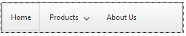
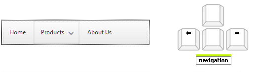
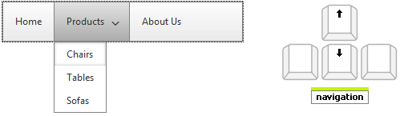

# Keyboard Support

The following article demonstrates the **Keyboard support** feature of the **RadNavigation** control

## 

In order to enable the keyboard support of the **RadNavigation** control, you should set the **TabIndex** property to **1**. Below you can find listed the key combination that you can use to navigate through the control:

* Use the "Tab" to focus the RadNabigation and the first node in particular: 

* Use the "Left" and "Right" arrows to navigate horizontally trough the nodes collection 

* Use the "Up" and "Down" arrows to navigate trough the child nodes
