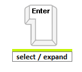
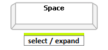
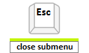

# Keyboard Support


A critical requirement for software accessibility is keyboard support as a complete alternative to pointing devices (mouse, etc.). Keyboard support is comprised of command key, focus key, and keyboard navigation. **RadNavigation** seamlessly switches between mouse and keyboard navigation.

Setting the control's **KeyboardNavigationSettings**, allows you to associate an activation combination (**CommandKey** + **FocusKey**), which moves focus to the **Navigation**'s first node and enables keyboard navigation. When there are multiple **RadNavigation** controls on a given page, each of them may have a different activation combination.

## Keyboard Navigation Settings

The **KeyboardNavigationSettings** exposes two properties to configure the keyboard combination that sets focus to the control: 

* **CommandKey**: [Ctrl] , [Alt] or [Shift].

* **FocusKey**: An upper-case letter or number.

Pressing **CommandKey** + **FocusKey** sets the focus on the **RadNavigation**'s first node and enables keyboard navigation. 

>note Certain keyboard combinations are reserved and used as shortcuts in the browsers. 
>


````ASP.NET
<telerik:RadNavigation ID="RadTabStrip1" runat="server" RenderMode="Lightweight">
    <KeyboardNavigationSettings CommandKey="Alt" FocusKey="M" />
</telerik:RadNavigation>
````

## Keyboard Navigation

* Focus the **RadNavigation**'s first node by pressing [CommandKey] + [FocusKey]:


* Navigate the nodes using Left and Right Arrows keys:


* Expand the submenus using Down and Up Arrows keys:


* Select a focused node and expand its submenu by pressing Enter:



* Select a focused node and expand its submenu by pressing Space bar:



* Close an expanded submenu by pressing Esc:


