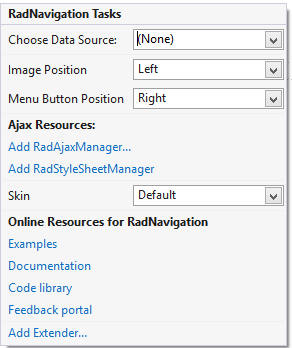
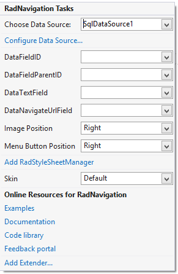

# Smart Tag

The **RadNavigation** Smart Tag allows easy access to frequently needed tasks. You can display the Smart Tag by right clicking on a **RadNavigation** control in the design window, and choosing **Show Smart Tag**.

## Unbound Smart Tag

When **RadNavigation** is unbound, the Smart Tag looks like the following:

Using the unbound **RadNavigation** Smart Tag you can perform the following:

## RadNavigation Tasks

* **Choose Data Source** lets you bind the menu declaratively by selecting a data source from a drop-down list of all available data source components. If you select **<New Data Source...>** the standard Windows [Data Source Configuration Wizard](https://msdn2.microsoft.com/en-us/library/ms247282(VS.80).aspx) appears, where you can create and configure a data source component.

* **Image Position** allows you to specify the position of the images set to the Node's **ImageUrl** property: Left or Right.

* **Menu Button Position** lets set the **Navigation**'s Menu Button Position: Left or Right.

## Ajax Resources

* **Add RadAjaxManager...** adds a RadAjaxManager component to your Web page, and displays the **RadAjaxManager Property Builder** where you can configure it.

* Add **RadStyleSheetManager** adds a **RadStyleSheetManager** to your Web page.

## Skin

The **Skin** drop-down lets you preview the built-in [skins]() and select one for your navigation.

## Learning Center

Links navigate you directly to **RadNavigation** examples, help, or code library. You can also search the Telerik web site for a given string.

## Bound Smart Tag

When **RadNavigation** is bound to a data source, the Smart Tag looks like the following:

>caption 

Using the bound **RadNavigation** Smart Tag you can perform the following:

## RadNavigation Tasks

* **Choose Data Source** lets you change the declarative navigation binding by selecting a data source from a drop-down list of all available data source components. If you select "**<New Data Source...>**" the standard Windows [Data Source Configuration Wizard](https://msdn2.microsoft.com/en-us/library/ms247282(VS.80).aspx) appears, where you can create and configure a data source component. If you select "**(None)**", you remove the existing binding.

* **Configure Data Source...** opens the standard Windows [Data Source Configuration Wizard](https://msdn2.microsoft.com/en-us/library/ms247282(VS.80).aspx), where you can configure the currently bound data source component.

* **Refresh Schema** refreshes the schema for the currently bound data source component.

* Once the Data Source is chosen, you can select each one of the following: **DataFieldID**,**DataFieldParentID**,**DataTextField** and **DataNavigationUrlField**. For the first two, you need to select the fields in the Data Source that will be used when creating the hierarchy of the RadNavigation. The rest will serve data respectively for the **Text** and **NavigateUrl** properties of RadNavigation Nodes.
