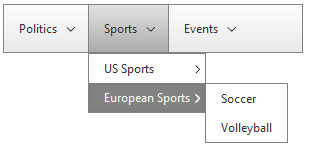
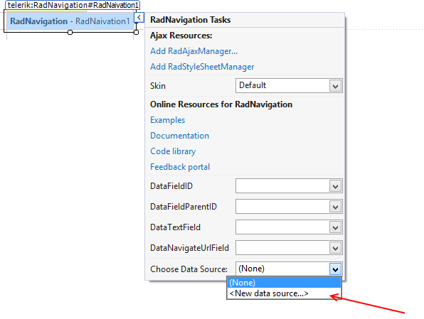
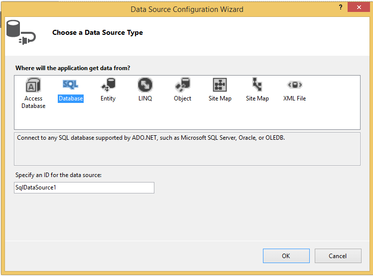
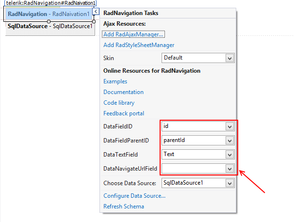

# Getting Started 


## 

The following tutorial demonstrates how you can add __RadNavigation__ bound to SqlDataSource control with three steps. The end result will be similar to __Figure 1__:
>caption Figure 1: RadNavigation bound to SqlDataSourcecontrol



1. Add a __ScriptManager__ control on a Web Form.

1. Add a __RadNavigation__ control on the Web Form:__Example 1__: Basic declaration of a __RadNavigation__ control:

````ASPNET
	        <telerik:RadScriptManager ID="RadScriptManager2" runat="server"></telerik:RadScriptManager>
	        <telerik:RadNavigation runat="server" ID="RadNavigation1"></telerik:RadNavigation>
````


1. Use the SmartTag of the __RadNavigation__ to assign SqlDataSource:

1. Use the Data Source Configuration Wizard to assign the DataSource and the preferable fields:

1. Assign the fields from the DataSource to the corresponding properties of the RadNavigation:
