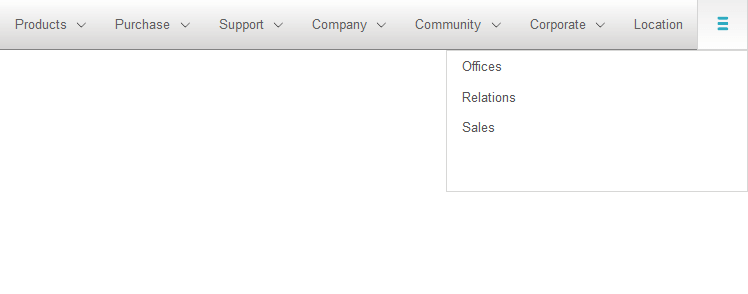
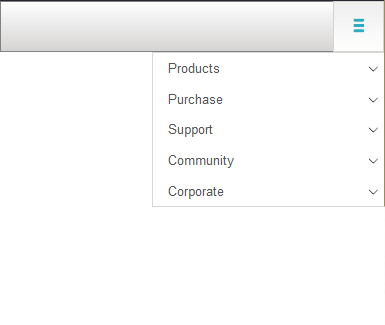

# Adaptive Behavior

The following article described the adaptive behavior of the __RadNavigation__ control

## 

The __RadNavigation__ control features responsive behavior, providing built-in support for both desktop and mobile browsers, with no need for RenderMode property changes. The rendered html remains the same, while control's appearance is changed by CSS and JavaScript. When there is not enough space for all nodes to be displayed, some of them will become part of the sandwich-like button.

The button could be displayed at the leftmost or rightmost side of the __RadNavigation__ control. This feature could be managed by the __MenuButtonPosition__ property, which accepts two values : __Left__ and __Right__.

In the figures below, you can observe how the layout of the RadNavigation changes, regarding the size of the browser. In __Figure 1__, there is enough space to display some nodes in the __RadNavigation__ and some under the sandwich-like button,while in __Figure__ 2 all nodes are paced under the button.
>caption Figure 1: Some nodes are placed under the sandwich-like button

>caption Figure 2: All nodes are placed under the sandwich-like button

