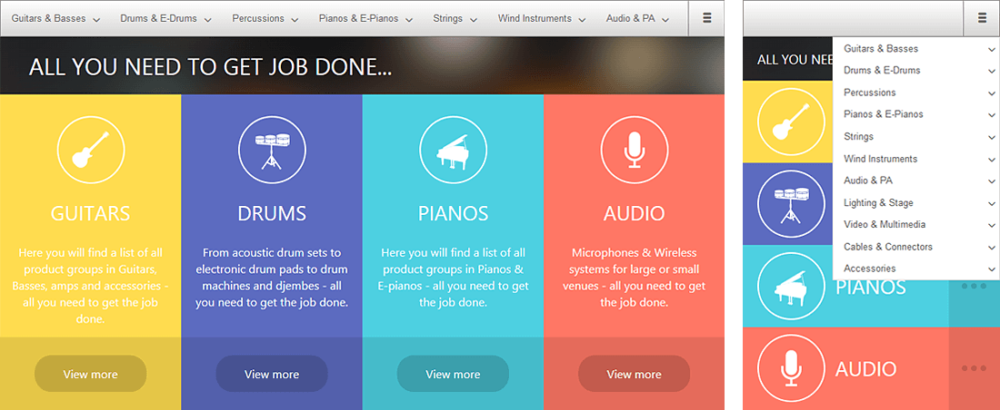

# Navigation Overview

Telerik **RadNavigation** for ASP.NET AJAX is a simple yet customizable navigation widget, which can be widely used in ASP.NET applications. The control has a built-in light-weight rendering and adaptive behavior.
>caption Figure 1: RadNavigation on desktop and mobile





## Key Features

* Light-weight rendering

* Built-in mobile support

* Server-side templates

* Keyboard support

* WCAG 2.0 and Section 508 Accessibility Compliant

* Visual Appeal – ships with rich set of skins for easy and consistent styling

# See Also

 * [Overview demo](https://demos.telerik.com/aspnet-ajax/navigation/overview/defaultcs.aspx)
