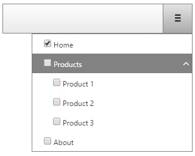

# Server Templates

## NodeTemplate

You can use the **NodeTemplate** for both setting template to a single navigation node and to all nodes in a navigation(applied as global template). For example you can set a global template to all navigation nodes and if you need to further customize only a single orseveral nodes you can do so by applying the **NodeTemplate** again only to the needed nodes. This can be done in the [TemplateNeeded]() event.

>note If a node has a template, it will not render an anchor (`<a>`) with the `NavigateUrl` property. If you want the node to act as an anchor, you should add the desired hyperlink in the template.

## Example

The following example (Figure 1.) shows a navigation that uses a global template for all parent and child nodes:
>caption Figure 1: Using NodeTemplate as a global template applied to all nodes.



````ASPNET
<telerik:RadNavigation runat="server" ID="RadNavigation2"  DataKeyNames="Text,Checked" DataFieldID="Id" DataFieldParentID="ParentId" DataTextField="Text">
</telerik:RadNavigation>
````

````C#
protected void Page_Load(object sender, EventArgs e)
{
	List<CustomNavigatorNode> nodes = new List<CustomNavigatorNode>();

	nodes.Add(new CustomNavigatorNode(1, "Home", true, "http://localhost"));
	nodes.Add(new CustomNavigatorNode(2, "Products", false, "http://localhost/Products"));
	nodes.Add(new CustomNavigatorNode(3, "About", false, "http://localhost/About"));
	nodes.Add(new CustomNavigatorNode(4, "Product 1", false, "http://localhost/Product-1", 2));
	nodes.Add(new CustomNavigatorNode(5, "Product 2", false, "http://localhost/Product-2", 2));
	nodes.Add(new CustomNavigatorNode(6, "Product 3", false, "http://localhost/Product-3", 2));

	RadNavigation1.DataSource = nodes;
	RadNavigation1.NodeTemplate = new CustomDataBoundTemplate();
	RadNavigation1.DataBind();
}

public class CustomDataBoundTemplate : ITemplate
{
	public void InstantiateIn(Control container)
	{
		CheckBox checkbox = new CheckBox();
		checkbox.ID = "CheckBox1";
		checkbox.DataBinding += delegate
		{
			NavigationNode bindingContainer = (NavigationNode)checkbox.BindingContainer;
			checkbox.Checked = (bool)bindingContainer.TemplateData["Checked"];
		};
		container.Controls.Add(checkbox);

		Label label = new Label();
		label.ID = "Label1";
		label.DataBinding += delegate
		{
			NavigationNode bindingContainer = (NavigationNode)label.BindingContainer;
			label.Text = bindingContainer.TemplateData["Text"].ToString();
		};
		container.Controls.Add(label);
		Label label1 = new Label();
		label1.ID = "Toggle";
		label1.CssClass = "rnvToggle radIcon";

		label1.DataBinding += delegate
		{
			NavigationNode bindingContainer = (NavigationNode)label1.BindingContainer;
			if (bindingContainer.Nodes.Count > 0)
			{
				label1.Visible = true;
			}
			else
			{
				label1.Visible = false;
			}
		};
		container.Controls.Add(label1);
	}
}

public class CustomNavigatorNode
{
	public int Id { get; set; }
	public string Text { get; set; }
	public bool Checked { get; set; }
	public string Url { get; set; }
	public int? ParentId { get; set; }

	public CustomNavigatorNode() { }

	public CustomNavigatorNode(int id, string text, bool isChecked, string url, int? parentId = null)
	{
		Id = id;
		Text = text;
		Checked = isChecked;
		Url = url;
		ParentId = parentId;
	}
}
````
````VB.NET
Protected Sub Page_Load(sender As Object, e As EventArgs)
	Dim nodes As New List(Of CustomNavigatorNode)()

	nodes.Add(New CustomNavigatorNode(1, "Home", True, "http://localhost"))
	nodes.Add(New CustomNavigatorNode(2, "Products", False, "http://localhost/Products"))
	nodes.Add(New CustomNavigatorNode(3, "About", False, "http://localhost/About"))
	nodes.Add(New CustomNavigatorNode(4, "Product 1", False, "http://localhost/Product-1", 2))
	nodes.Add(New CustomNavigatorNode(5, "Product 2", False, "http://localhost/Product-2", 2))
	nodes.Add(New CustomNavigatorNode(6, "Product 3", False, "http://localhost/Product-3", 2))

	RadNavigation1.DataSource = nodes
	RadNavigation1.NodeTemplate = New CustomDataBoundTemplate()
	RadNavigation1.DataBind()
End Sub

Public Class CustomDataBoundTemplate
	Implements ITemplate
	Public Sub InstantiateIn(container As Control)
		Dim checkbox As New CheckBox()
		checkbox.ID = "CheckBox1"
		checkbox.DataBinding += Sub()
									Dim bindingContainer As NavigationNode = DirectCast(checkbox.BindingContainer, NavigationNode)
									checkbox.Checked = CBool(bindingContainer.TemplateData("Checked"))

								End Sub
		container.Controls.Add(checkbox)

		Dim label As New Label()
		label.ID = "Label1"
		label.DataBinding += Sub()
								 Dim bindingContainer As NavigationNode = DirectCast(label.BindingContainer, NavigationNode)
								 label.Text = bindingContainer.TemplateData("Text").ToString()

							 End Sub
		container.Controls.Add(label)
		Dim label1 As New Label()
		label1.ID = "Toggle"
		label1.CssClass = "rnvToggle radIcon"

		label1.DataBinding += Sub()
								  Dim bindingContainer As NavigationNode = DirectCast(label1.BindingContainer, NavigationNode)
								  If bindingContainer.Nodes.Count > 0 Then
									  label1.Visible = True
								  Else
									  label1.Visible = False
								  End If

							  End Sub
		container.Controls.Add(label1)
	End Sub
End Class

Public Class CustomNavigatorNode
	Public Property Id() As Integer
		Get
			Return m_Id
		End Get
		Set(value As Integer)
			m_Id = Value
		End Set
	End Property
	Private m_Id As Integer
	Public Property Text() As String
		Get
			Return m_Text
		End Get
		Set(value As String)
			m_Text = Value
		End Set
	End Property
	Private m_Text As String
	Public Property Checked() As Boolean
		Get
			Return m_Checked
		End Get
		Set(value As Boolean)
			m_Checked = Value
		End Set
	End Property
	Private m_Checked As Boolean
	Public Property Url() As String
		Get
			Return m_Url
		End Get
		Set(value As String)
			m_Url = Value
		End Set
	End Property
	Private m_Url As String
	Public Property ParentId() As System.Nullable(Of Integer)
		Get
			Return m_ParentId
		End Get
		Set(value As System.Nullable(Of Integer))
			m_ParentId = Value
		End Set
	End Property
	Private m_ParentId As System.Nullable(Of Integer)

	Public Sub New()
	End Sub

	Public Sub New(id**1 As Integer, text**2 As String, isChecked As Boolean, url**3 As String, Optional parentId**4 As System.Nullable(Of Integer) = Nothing)
		Id = id__1
		Text = text__2
		Checked = isChecked
		Url = url__3
		ParentId = parentId__4
	End Sub
End Class
````

# See Also

 * [Overview]()
