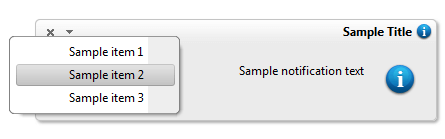

# Right-to-left Support


## 

The **RadNotification** fully supports right-to-left (RTL) language locales. It is created and added to the page root (as a direct child of the form element) and in order to turn on the RTL support you should set **dir=rtl to the html or body** element.

````ASPNET
	        html
	        {
	            direction: rtl;
	        }
````


````ASPNET
	    <telerik:RadNotification ID="RadNotification1" runat="server" VisibleOnPageLoad="true"
	        ShowTitleMenu="true" Title="Sample Title" Text="Sample notification text" Position="BottomLeft"
	        OffsetX="30" OffsetY="-30" Height="100" Width="400" AutoCloseDelay="0" EnableRoundedCorners="true"
	        EnableShadow="true">
	        <NotificationMenu>
	            <Items>
	                <telerik:RadMenuItem Text="Sample item 1">
	                </telerik:RadMenuItem>
	                <telerik:RadMenuItem Text="Sample item 2">
	                </telerik:RadMenuItem>
	                <telerik:RadMenuItem Text="Sample item 3">
	                </telerik:RadMenuItem>
	            </Items>
	        </NotificationMenu>
	    </telerik:RadNotification>
````



# See Also

 * [See this live in an online demo](http://demos.telerik.com/aspnet-ajax/notification/examples/righttoleft/defaultcs.aspx)
