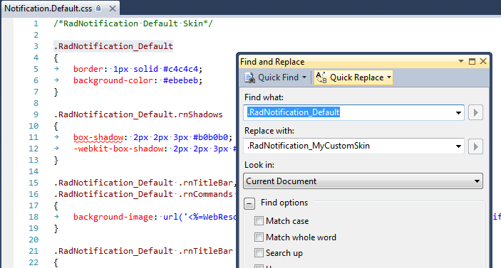
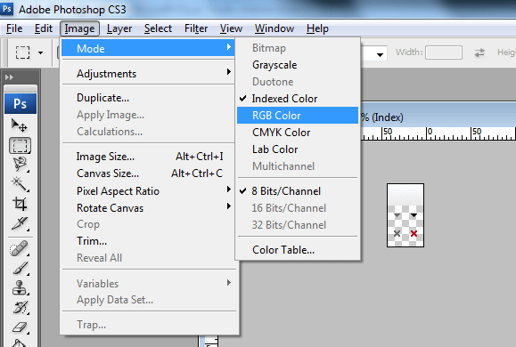
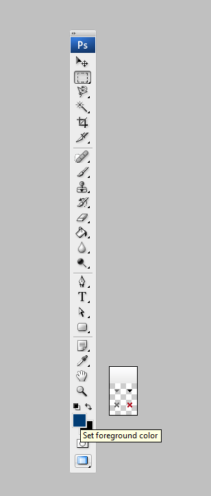
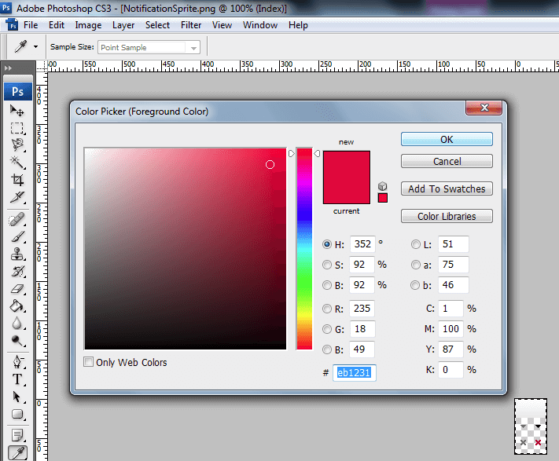
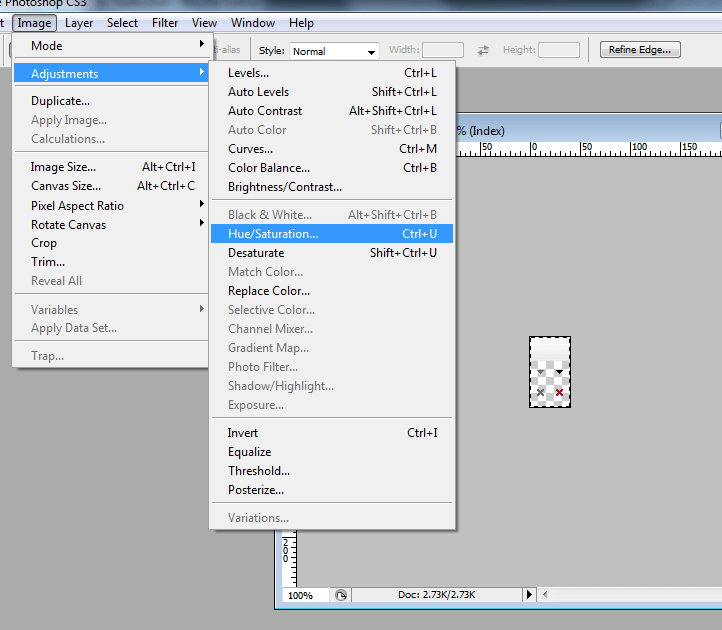
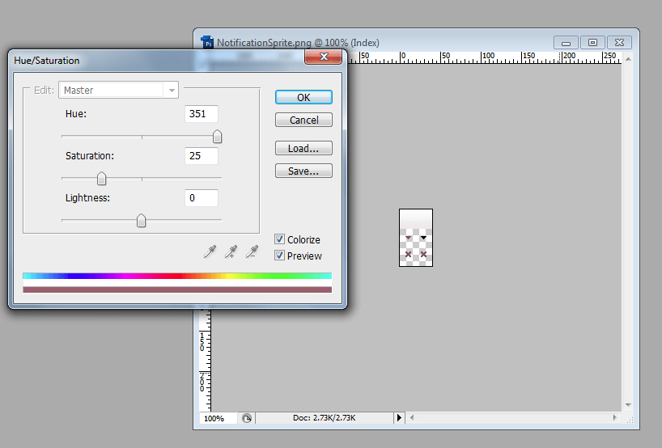

# Create a Custom Skin

## Skinning Overview

Each of the controls included in the Telerik® UI for ASP.NET AJAX suite is styled by two CSS files that are loaded in a certain order. The first one - ControlName.css, also called the base stylesheet, contains CSS properties and values that are common for all skins, i.e. it is layout-specific, not skin-specific. These are CSS float, padding, margin, font-size, font-family, etc. In the general case, when creating a custom skin for a control this file should not be edited, unless the custom skin needs different sizes, paddings or margins. The second file represents the actual skin of the control, and its name consists of the control name plus the skin name, i.e. Notification.Default.css. Upon creating a custom skin for the control, one should edit that particular file, as it contains skin-specific CSS properties, and references to images, colors, borders and backgrounds.

The **RadNotification** control contains one more control from Telerik AJAX UI Suite: **RadContextMenu** which is also styled with two CSS files that are loaded in a certain order. In order to have custom RadNotification it will be necessary to customize also **RadContextMenu** ([Creating a custom skin for RadMenu]()).

## Creating a Custom Skin for RadNotification for ASP.NET AJAX from an Existing One

1. In your project, create a new directory named Skins.

1. In the Skins folder create a new directory MyCustomSkin.

1. Go to **~/[TelerikControlsInstallationFolder]/Skins/Default** and copy **Notification.Default.css** and the **Skins/Default/Notification** folder in your Skins folder.

1. Rename **Notification.Default.css** to **Notification.MyCustomSkin.css** and the folder Default to MyCustomSkin.

1. When you are finished you should have **Skins/MyCustomSkin/Notification.MyCustomSkin.css** and **Skins/MyCustomSkin/Notification**. The last folder contains the images for MyCustomSkin.

1. In order to support multiple skins of RadNotification on a single page, the wrapping skin-specific class is coined by the name of the control, RadNotification plus underscore ("_") plus SkinName, i.e. .RadNotification_Default, so in order to create a custom skin out of the Default skin, we should rename all occurrences of "Default" in **Notification.MyCustomSkin.css** to "MyCustomSkin" as shown below:
	
	

1. Add a new server declaration of RadNotification on your page, and set **Skin="MyCustomSkin"** and **EnableEmbeddedSkins=”false”**:

	**ASP.NET**

		    <telerik:RadNotification RenderMode="Lightweight" ID="RadNotification1" runat="server" Title="Title" EnableShadow="true"
		        EnableRoundedCorners="true" EnableEmbeddedSkins="false" ShowTitleMenu="true"
		        Width="400" OffsetX="-60" OffsetY="-230" ShowInterval="500" Animation="Fade" Skin="MyCustomSKin"
		        Text="Morbi sed turpis at tortor malesuada condimentum id laoreet felis.">
		    </telerik:RadNotification>

1. Register **Notification.MyCustomSkin.css** in the head section of your webpage. In order to have the CSS applied correctly, the base stylesheet should come first in the DOM:

	**HTML**

	    <link href="Skins/MyCustomSkin/Notification.MyCustomSkin.css" rel="stylesheet" type="text/css" />

1. Make sure the path to the files is correct; otherwise the skin will not apply.

1. Reload the page, and if the steps 0-9 have been followed correctly, you will see RadNotification running a custom Default skin set as an external resource.

## Modifying the Image Sprites to Achieve Totally New Looks for the Skin

Each skin of RadNotification consists of one image sprite that is contained in the Skins/SkinName/Notification folder.

NotificationSprite.png contains horizontal titlebar gradient and buttons for the navigation.

Explained below is a simple method for modifying the image sprites of RadNotification with Adobe© PhotoShop to achieve new looks without creating a new design:

1. Drag NotificationSprite.png in Adobe© PhotoShop.

1. From the menu bar select Image » Mode » RGB Color to prepare the images for editing (convert from optimized Indexed Color to RGB Color):

	

1. Press Set Foreground Color in PhotoShop's toolbox to invoke the color picker dialog:
	
	

1. Select a color that you like from the color dialog and then close it:
	
	

1. Choose the image you will modify - **NotificationSprite.png**, and select Image » Adjustments » Hue/Saturation to open the Hue/Saturation dialog of Adobe© PhotoShop:

	

1. Check the colorize checkbox in the Hue / Saturation dialog, and the image you have selected will be immediately colorized in the hue you have selected from the toolbox:

	

	You may then play with the Hue, Saturation and Lightness sliders to fine tune or further modify the image.

1. Press "OK" when you are finished.

1. Select Image » Mode » Indexed Color to flatten the layers of the image.

1. Save and close the image.

1. Once you are ready, save your work and reload the page. You will have a brand new skin based on Telerik's Default skin of RadNotification.

# See Also

 * [Skins]()

 * [CSS Skin File Selectors]()

 * [Controlling Appearance]()

 * [Telerik ThemeBuilder for ASP.NET AJAX](https://themebuilder.telerik.com/)

