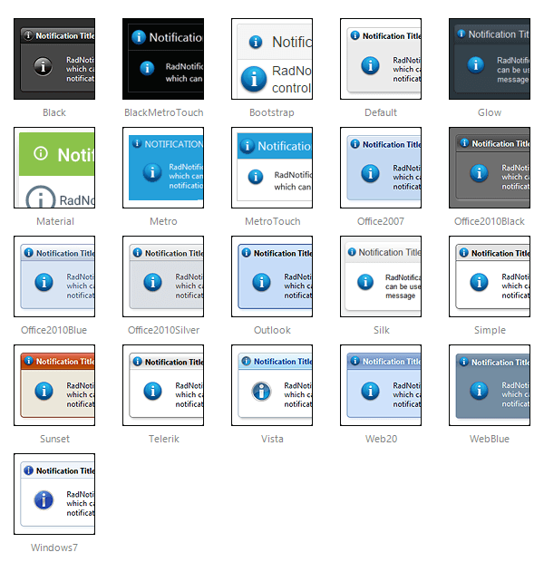

# Skins

To make customizing the appearance of **RadNotification** as easy as possible, the control uses skins. A skin is a set of images and a CSS stylesheet that are applied to the HTML elements which make up the notification, defining the look and feel.

To apply a skin, set the **Skin** property of the **RadNotification**. You can set the it by using the properties pane, the server-side property or the control's Smart Tag.

**RadNotification** is installed with a number of predefined skins:

 

 @[template - Material skin is available only in Lightweight mode](/_templates/common/skins-notes.md#material-only-in-lightweight) 

>note The **Shadow** and **Rounded Corners** are achieved via CSS3 properties and will not have effect under browsers that do not support them (such as IE8 and prior, FireFox 3, etc).

# See Also

 * [Smart Tag]()
