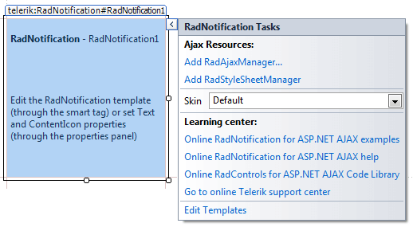
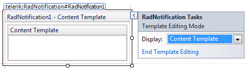

# Design Time

The Smart Tag of **RadNotification** lets you easily change the skin for your control or quickly get help. You can display the Smart Tag by right clicking on a **RadNotification** control and choosing "Show Smart Tag", or clicking the small rightward-pointing arrow located in the upper right corner of the control.

## Ajax Resources

* **Add RadAjaxManager...** adds a **RadAjaxManager** component to your Web page, and displays the **r.a.d.ajax Property Builder** where you can configure it.

* **Add RadStyleSheetManager** adds a **RadStyleSheetManager** to your Web page.

## Skin

The **Skin** drop-down displays a list of available [skins]() that you can apply to your control, along with an example of what the tool tips look like for each skin. Assign a skin by selecting from the list.

## Learning Center

* Links navigate you directly to examples, help, and code library.

* You can navigate directly to the [Telerik Support Center](https://www.telerik.com/support/home.aspx).

## Edit the template

At the bottom you can find the Edit Templates link that allows you to modify the ContentTemplate of the notification and add rich content as well. When you click that link you can type text or drag controls in the content template that opens in the RadNotification placeholder. When you are done you need to click the End Template Editing link in the Smart Tag.

# See Also

 * [Skins]()
