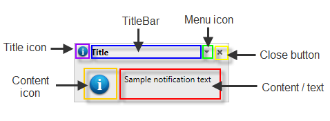

# RadNotification Structure

The main visual elements of **RadNotification** are:
 

* **TitleBar:** This is the title of the notification.
* **TitleIcon:** The small image (16x16 pixels) shown in the titlebar.
* **Menu Icon:** The button used to show the title menu. It appears only if the **ShowTitleMenu** property is set to true.
* **Close Button:** The button used to close the notification. It appears only if the **ShowCloseButton** property is set to true.
* **ContentIcon:** The image (32x32 pixels) shown in the content area of the notification.
* **Content or Text:** This is the main part of the control. It can be customized using Text property or by declaring content between the RadNotification's ContentTemplate tags in ASP.NET.

# See Also

 * [Overview]()
