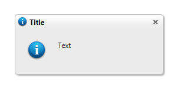
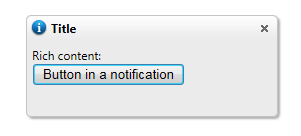

# Populate Static Content

Content can be added to **RadNotification** in multiple ways and is displayed in the following order of precedence:

1. Setting simple content:
	1. Setting the **Text** property:
		
		__C#__

	        RadNotification1.Text = "Sample Notification text";
	        RadNotification1.TitleIcon = "info";
	        RadNotification1.ContentIcon = "info";

		__VB__

	        RadNotification1.Text = "Sample Notification text"
	        RadNotification1.TitleIcon = "info"
	        RadNotification1.ContentIcon = "info"

	1. Setting the **Title** property:

		__C#__

	        RadNotification1.Text = "Sample Notification text";
	        RadNotification1.Title = "Title";
	        RadNotification1.TitleIcon = "info";
	        RadNotification1.ContentIcon = "info";

		__VB__

	        RadNotification1.Text = "Sample Notification text"
	        RadNotification1.Title = "Title"
	        RadNotification1.TitleIcon = "info"
	        RadNotification1.ContentIcon = "info"
		
		

1. Setting rich content:

	1. Setting content declaratively between the opening and closing tags of the notification's ContentTemplate:
	
		__ASP.NET__

		    <telerik:RadNotification runat="server" ID="RadNotification1" VisibleOnPageLoad="true"
		        TitleIcon="info" ContentIcon="info" Width="250px" Height="100px">
		        <ContentTemplate>
		            Rich content: 
		            <asp:Button ID="Button1" Text="Button in a notification" runat="server" />
		        </ContentTemplate>
		    </telerik:RadNotification>

		

	1. Setting content dynamically through the code-behind:

		__ASP.NET__

		    <telerik:RadNotification runat="server" ID="RadNotification2" VisibleOnPageLoad="true"
		        Width="250px" Height="100px">
		        <ContentTemplate>
		        </ContentTemplate>
		    </telerik:RadNotification>

		>caution If you are planning to add controls dynamically you need to declare an empty **ContentTemplate** , since if it is not present **RadNotification** automatically detects it and enters into simple content mode and you will not be able to add controls in it.

		
		__C#__

	        RadNotification1.ContentContainer.Controls.Add(new LiteralControl("Rich content: "));
	        Button button = new Button();
	        button.ID = "Button1";
	        button.Text = "Button in a notification";
	        RadNotification1.ContentContainer.Controls.Add(button);
	        RadNotification1.TitleIcon = "info";
        	RadNotification1.ContentIcon = "info";

		__VB__

	        RadNotification1.ContentContainer.Controls.Add(new LiteralControl("Rich content: "))
	        Dim button As new Button()
	        button.ID = "Button1"
	        button.Text = "Button in a notification"
	        RadNotification1.ContentContainer.Controls.Add(button)
	        RadNotification1.TitleIcon = "info"
	        RadNotification1.ContentIcon = "info"

