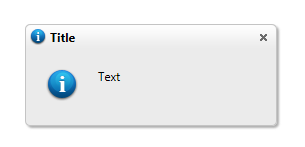

# Populate Static Content

Content can be added to **RadNotification** in multiple ways and is displayed in the following order of precedence:

Setting simple content:

- Setting the **Text** property:

````C#
	RadNotification1.Text = "Sample Notification text";
	RadNotification1.TitleIcon = "info";
	RadNotification1.ContentIcon = "info";
````
````VB
	RadNotification1.Text = "Sample Notification text"
	RadNotification1.TitleIcon = "info"
	RadNotification1.ContentIcon = "info"
````

- Setting the **Title** property:

````C#
	RadNotification1.Text = "Sample Notification text"
	RadNotification1.Title = "Title"
	RadNotification1.TitleIcon = "info"
	RadNotification1.ContentIcon = "info";
````
````VB
	RadNotification1.Text = "Sample Notification text"
	RadNotification1.Title = "Title"
	RadNotification1.TitleIcon = "info"
	RadNotification1.ContentIcon = "info"
````




Setting rich content:

- Setting content declaratively between the opening and closing tags of the notification's ContentTemplate:
	
````ASP.NET
	<telerik:RadNotification RenderMode="Lightweight" runat="server" ID="RadNotification1" VisibleOnPageLoad="true"
		TitleIcon="info" ContentIcon="info" Width="250px" Height="100px">
		<ContentTemplate>
			Rich content:<br />
			<asp:Button ID="Button1" Text="Button in a notification" runat="server" />
		</ContentTemplate>
	</telerik:RadNotification>
````


- Setting content dynamically through the code-behind:

````ASP.NET
<telerik:RadNotification RenderMode="Lightweight" runat="server" ID="RadNotification2" VisibleOnPageLoad="true"
    Width="250px" Height="100px">
    <ContentTemplate>
    </ContentTemplate>
</telerik:RadNotification>
````

>note If you are planning to add controls dynamically you need to declare an empty **ContentTemplate** , since if it is not present **RadNotification** automatically detects it and enters into simple content mode and you will not be able to add controls in it. If you want to create the control entirely in the code-behind, you should add implement an `ITemplate` class and use that for its `ContentTemplate` instead of populating the `ContentContainer.Controls` collection directly.

````C#
	RadNotification1.ContentContainer.Controls.Add(new LiteralControl("Rich content:<br />"));

	Button button = new Button();
	button.ID = "Button1";
	button.Text = "Button in a notification";

	RadNotification1.ContentContainer.Controls.Add(button);
	RadNotification1.TitleIcon = "info";
    RadNotification1.ContentIcon = "info";
````
````VB
	RadNotification1.ContentContainer.Controls.Add(new LiteralControl("Rich content:<br />"))

	Dim button As new Button()
	button.ID = "Button1"
	button.Text = "Button in a notification"
	
	RadNotification1.ContentContainer.Controls.Add(button)
	RadNotification1.TitleIcon = "info"
	RadNotification1.ContentIcon = "info"
````

   