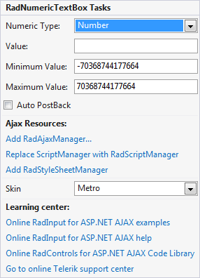

# Smart Tag

The **RadInput** Smart Tag allows easy access to frequently needed tasks. You can display the **Smart Tag** by right clicking on a **RadInput** control in the design window, and choosing **Show Smart Tag** from its context menu.

The **RadNumericTextBox** Smart Tag contains the same **Ajax Resources**, **Skin**, and **Learning Center** sections as the other **RadInput** controls. In addition, the **RadNumericTextBox** Smart Tag lets you do the following :

RadNumericTextBox Tasks

* **NumericType** lets you set the **Type** property by selecting a type from the drop-down list. The **Type** property governs the basic formatting of numeric values, according to the settings of the current **Culture**.**Numeric Type** can be set to "Number", "Currency", or "Percent".

* **Value** lets you set the **Value** property to a numeric value.

* **Minimum Value** lets you set the **MinValue** property to a numeric value.

* **Maximum Value** lets you set the **MaxValue** property to a numeric value.

