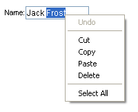

# Context Menus

## 

All of the **RadInput** controls display a built-in context menu when the user right-clicks on the control with the mouse.

The built-in context menu contains the following commands:

* **Undo**: Backs out the edit that was just made using the context menu or a shortcut key combination.

* **Cut**: Cuts the selected text to the clipboard.

* **Copy**: Copies the selected text to the clipboard.

* **Paste**: Pastes the text in the clipboard, replacing the current selection or, if there is no selected text, inserting it at the cursor.

* **Delete**: Deletes the currently selected text.

* **Select All**: selects all the text.

