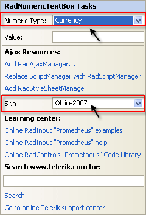
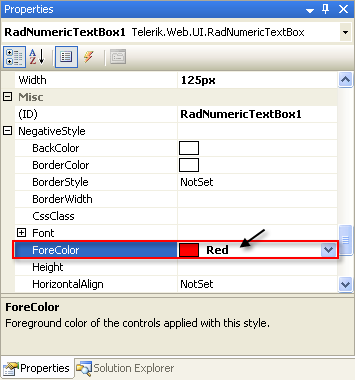
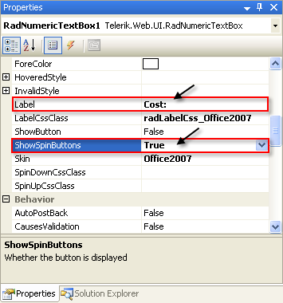
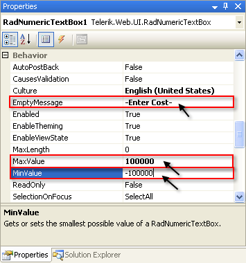
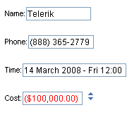

# Getting Started With RadNumericTextBox

This tutorial will walk you through creating a Web page that uses the **RadNumericTextBox** control. It shows how to:

* Apply a **Skin** to customize the look and feel.

* Add labels to the input controls.

* Specify formats for display and editing.

* Specify maximum and minimum values.

1. Drag a **RadNumericTextBox** control from the toolbox onto your Web page. I

1. In the **RadNumericTextBox** Smart Tag, set the **Numeric Type** to "Currency" and the **Skin** to "Office2007":

1. When you set the **Type** of the **RadNumericTextBox** control to "Currency", it automatically updated its **NumberFormat** property to reflect the settings associated with the current value of its **Culture** property. You can tweak that formatting by setting the **NegativeStyle** and **NumberFormat** properties. Do that now by changing the **ForeColor** sub-property of the **NegativeStyle** property to "Red":

1. In the **Appearance** section of the properties pane, set the **Label** of the numeric text box to "Cost:" and the **ShowSpinButtons** property to **True**:

1. In the **Behavior** section of the properties pane, set the **EmptyMessage** property to "-Enter Cost-", the **MaxValue** property to "100000" and the **MinValue** property to "-100000":

1. Experiment with entering data in the controls:

* On the **RadNumericTextBox** control, click the up arrow of the spin button. Note that a value appears, formatted as currency. Try to type "-200000" in the input area. This value is less than the minimum value you specified, so when you exit the control, it sets the value to the minimum value of -100000. Note that this value appears in red because of the **NegativeStyle** property:

