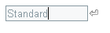
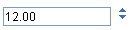
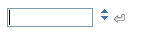
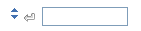
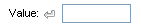

# Adding Buttons


## Adding a generic button

You can easily add a button to any of the **RadInput** controls by setting the **ShowButton** property to **True**. When you set **ShowButton** to **True**, a button appears on the right side of the input control. The button appears as a small bent arrow:



The appearance of the arrow varies, depending on the [Skin]() of the input control. To change the image of the button to something other than a bent arrow, use the **ButtonCssClass** property:

1. Define a CSS class that provides an image for the button. You can link in your own CSS file, or define the CSS class by adding a \<style\> section to the \<head\> element of your Web page:

````HTML
<head runat="server">
	<title>Untitled Page</title>
	<style>
		.MyButton
		{
			background: url('~/App_Data/CustomButton.gif') 0 0 no-repeat !important;
		}
	</style>
</head>
````


1. Set the **ButtonCssClass** property:

````ASPNET
<telerik:RadTextBox ID="RadTextBox1" runat="server" ShowButton="True" Skin="WebBlue"
	ButtonCssClass="MyButton">
	<ClientEvents OnButtonClick="HandleButtonClick" />
</telerik:RadTextBox>
````


## Adding a Spin button

In addition to a generic button, you can add spin buttons to the the **RadNumericTextBox** control. To add a set of spin buttons, set the **ShowSpinButtons** property to **True**. The spin buttons appear as two arrows:


As with generic buttons, the appearance of the spin buttons varies, depending on the **Skin** property. You can further customize the appearance of the spin buttons using the **SpinUpCssClass** and **SpinDownCssClass** properties.

## Specifying the button position

By default, the buttons you add appear on the right of the input control. If you have added both a generic button and a set of spin buttons, the generic button appears to the left of the spin buttons:


To move the buttons to the left of the input control, change the **ButtonsPosition** property to "Left":


If the input control has a label, setting **ButtonsPosition** to "Left" positions the button after the label:



## Implementing the button behavior

Spin buttons have built-in behavior: when the user clicks the up arrow, the value in the text box increases by the amount of the **IncrementSettings.Step** property; when the user clicks the down arrow, the value decreases by the same amount.

Generic buttons have no such built-in behavior. To implement the behavior of a generic button, write a JavaScript function that is called when the user clicks the button, and assign it as the value of the **[OnButtonClick]()** client-side event:

````ASPNET
<script type="text/javascript">
	function ShowSelectionForm(sender, eventArgs)
	{
		window.radopen("SelectionForm.aspx", "Specify a Value");
	}
</script>
<telerik:RadTextBox ID="RadTextBox1" runat="server" ShowButton="True">
	<ClientEvents OnButtonClick="ShowSelectionForm" />
</telerik:RadTextBox>
````


# See Also

 * [OnButtonClick]()

 * [Structure]()
