# Getting Started Overview

## 

This tutorial will walk you through creating a Web page that uses **RadInput** controls. It shows how to:

* Use the four different RadInput controls (**RadTextBox**, **RadMaskedTextBox**, **RadDateInput**, and **RadNumericTextBox**).

* Apply a **Skin** to customize the look and feel.

* Add labels to the input controls.

* Add messages to appear when nothing is entered.

* Customize the selection behavior when the control receives focus.

* Specify formats for display and editing.

* Specify maximum and minimum values.

1. Drag a **RadTextBox** control from the toolbox onto your Web page. It's [Smart Tag]() should appear automatically.
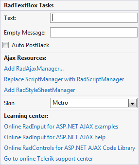

1. In the **RadTextBox** Smart Tag,
	* Set the **Empty Message** to "-Enter a name-". This message will appear in the text box when the user has not entered any text.
	* Open the **Skin** drop-down. It lets you preview the available skins and choose a skin to give the text box its general look-and-feel. Choose "Office2007".
	
	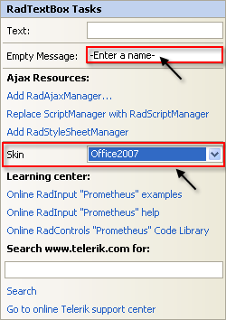
1. In the designer, right-click the **RadTextBox** control and choose **Properties** from its context menu:
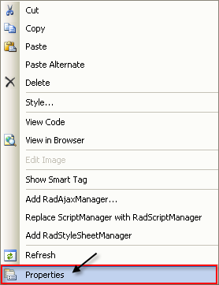

1. In the properties pane for the **RadTextBox** control, set the **Label** property to "Name:". Note that a label automatically appears in the **RadTextbox** control.
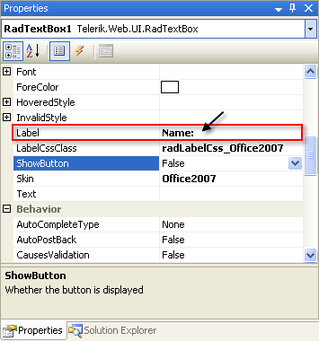

1. In the **Behavior** section of the properties pane, locate the **SelectionOnFocus** property and change it to "SelectAll". This causes the entire text in the text box to become selected when focus moves to the text box so that it is replaced when the user starts typing. Other options move the caret to the beginning or end of the text box.
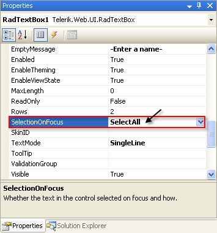

1. In the designer, type the enter key to add a line or two after the text box, and then drag a **RadMaskedTextBox** control from the toolbox onto the design surface. It's Smart Tag should appear automatically.

1. In the **RadMaskedTextBox** Smart Tag, click the link labelled **SetMask**:
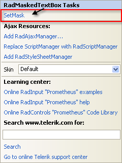

1. The [Input Mask dialog]() appears. In the dialog, choose the mask for **Phone number** hand click **OK**.
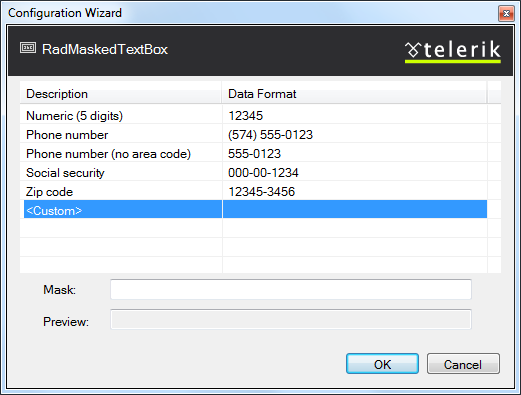

1. Choose the "Office2007" Skin in the Smart Tag so that the masked text box matches the other text box on your page.

1. In the designer, right-click on the **RadMaskedTextBox** control and choose **Properties** from its context menu.

1. In the properties pane, set the **Label** property to "Phone:"
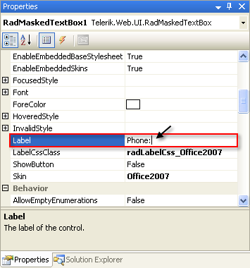

1. In the **Behavior** section of the properties pane, set the **EmptyMessage** property to "-Enter Phone Number-" and the **HideOnBlur** property to **True**. Because the **Mask** property is set, the masked text box displays the mask when no text has been entered. By setting the **HideOnBlur** property, you cause the masked text box to show the value of **EmptyMessage** instead when the control does not have focus.

1. In the designer, type the enter key to add a line or two after the masked text box, and then drag a **RadDateInput** control from the toolbox onto the design surface. It's Smart Tag should appear automatically.

1. In the **RadDateInput** Smart Tag, click the link labelled **Set Display Date Format**.
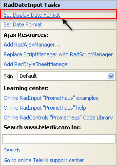

1. The [Date Format dialog]() appears. Enter the string "dd MMMM yyyy - ddd hh:mm" as a **CustomDate Time Format** and click **OK.**
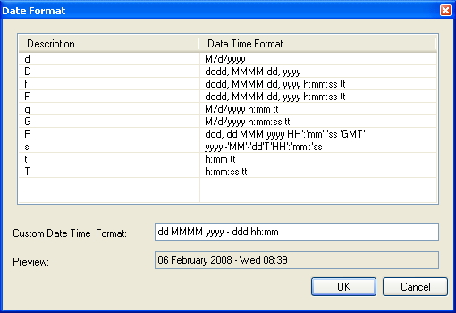
	The string you entered in the **Date Format dialog** becomes the value of the **DisplayDate** property. That is, it is the ASP.NET DateTime format string that the **RadDateInput** control uses to display its current value when it does not have focus.

1. Back in the Smart Tag, click the link labelled **Set Date Format** to bring up the **Data Format dialog** a second time. This time, choose the pre-defined "g" format and click **OK**.
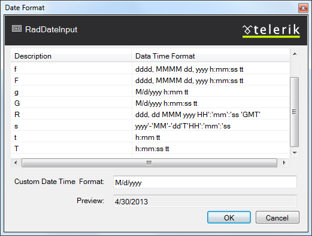
	The format you chose becomes the value of the **DateFormat** property. That is, it is the ASP.NET DateTime format string that the **RadDateInput** control uses to display its current value when it has input focus and the user can edit the value.

1. Set the **Skin** property to "Office2007" so that the **RadDateInput** control matches the two text box controls.

1. In the properties pane for the **RadDateInput** control, set the **Label** property to "Time:"
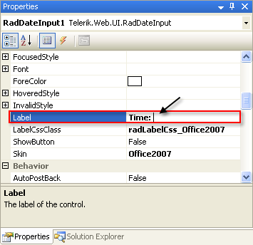

1. Set the **EmptyMessage** property to "-Enter a date and time-"
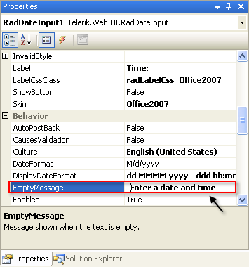

1. In the designer, type the enter key to add a line or two after the **RadDateInput** control, and then drag a **RadNumericTextBox** control from the toolbox onto the design surface.

1. In the **RadNumericTextBox** Smart Tag, set the **Numeric Type** to "Currency" and the **Skin** to "Office2007":
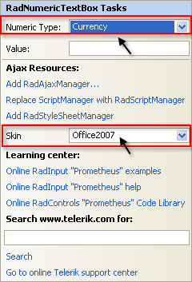

1. When you set the **Type** of the **RadNumericTextBox** control to "Currency", it automatically updated its **NumberFormat** property to reflect the settings associated with the current value of its **Culture** property. You can tweak that formatting by setting the **NegativeStyle** and **NumberFormat** properties. Do that now by changing the **ForeColor** sub-property of the **NegativeStyle** property to "Red":
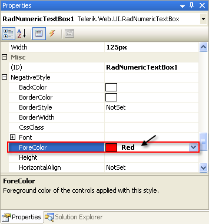

1. In the **Appearance** section of the properties pane, set the **Label** of the numeric text box to "Cost:" and the **ShowSpinButtons** property to **True**:
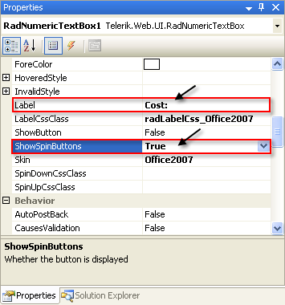

1. In the **Behavior** section of the properties pane, set the **EmptyMessage** property to "-Enter Cost-", the **MaxValue** property to "100000" and the **MinValue** property to "-100000":
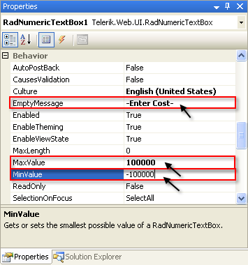

1. Run the application. The strings you entered for the **EmptyMessage** properties appear in the input controls, because they do not have any values entered. The labels all appear next to the input area. On the **RadNumericTextBox** control, the spin buttons appear next to the input area:
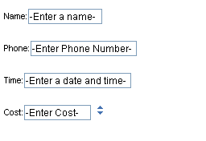

1. Experiment with entering data in the controls:

* On the **RadTextBox** control, note that the entire string becomes selected when you move focus to the control.

* On the **RadMaskedTextBox** control, note that the edit mask appears when you move focus to the control. Try to enter a non-numeric value. It is rejected by the control because it does not match the mask.

* On the **RadDateInput** control, enter a date and time value. Note that the control uses a different format, depending on whether it has input focus.

* On the **RadNumericTextBox** control, click the up arrow of the spin button. Note that a value appears, formatted as currency. Try to type "-200000" in the input area. This value is less than the minimum value you specified, so when you exit the control, it sets the value to the minimum value of -100000. Note that this value appears in red because of the **NegativeStyle** property:
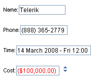
