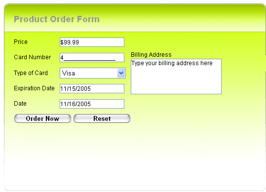

# Input Overview

## 

The Telerik **RadInput** Prometheus controls are a set of four highly configurable components for controlled data input in ASP.NET applications. The four controls - **RadTextBox**, **RadNumericTextBox**, **RadMaskedTextBox** and **RadDateInput** - are each designed for allowing users to enter a particular type of value, and automatically restrict the values users can enter to that type. They automatically handle the parsing of values that the user enters and formatting of their values for display.

While each of the **RadInput** controls has its own unique features, designed to support a particular data type, they all share a number of common features, so that you can take advantage of the same rich set of options, no matter what type of data you want to collect.

The common features of the **RadInput** controls include

* A [client-side API]() with powerful methods to let you configure the input controls and [numerous events]() to let you respond to almost everything the user does with the controls.

* [Keyboard]() and [mouse wheel]() support.

* Built-in copy and paste support that users can invoke with both keyboard shortcuts and a built-in [context menu]().

* [Skins]() to change the look and feel of the input controls so that they match the other controls on your Web page.

* [Style properties]() that let you configure the look of the input control, depending on its current state.

* The ability to add [labels]() and [buttons]() that are associated with the input control.

* [Empty message]() support.

* Client/Server side [data validation]().

* Caret positioning and text selection when the control [receives focus]().

* Optional [postback]() when the user changes the value.

* Support for all major browsers, including Internet Explorer 6.0 and above, Mozilla Firefox 2.0 and above, Google Chrome 2.0 and above, Opera 9.0 and above, and Safari 3.0 and above.

In addition to these common features, each **RadInput** control provides its own unique features, designed to make it as easy as possible to work with a particular type of data:

[Overview]() - a text control that can accept all characters (alphabet, numeric and symbols). **RadTextBox** controls support the following features:

* Single-line, password, and multi-line modes.

* AutoComplete support in participating browsers.

* MaxLength property to define the max length of characters allowed to be entered

**[RadNumericTextBox]()** - an input control that accepts only numeric entries. **RadNumericTextBox** controls support the following features:

* Currency, Percentage, or Number mode

* Formatting options based on Culture settings or [your own detailed requirements]().

* Increment/Decrement with mouse wheel, arrow keys, and spin buttons.

* Nullable **DbValue** property

**[RadMaskedTextBox]()** - an enhanced data entry control which uses a mask to distinguish between proper and improper user input. You can use a mask to specify the accepted format such as IP address, telephone number, currency, etc.RadMaskedTextBox controls support the following features.

* Built-in support for the most commonly used [masks]() (phone, email, social security, state, zip, etc.)

* Multi-line mode

**[RadDateInput]()** - an input control that [formats]() and validates DateTime values, and and has 'smart' [parsing engine]() which recognizes whether the user entry can be converted to DateTime format or not. **RadDateInput** controls support the following features:

* Client-side methods for parsing strings into date values.

* An OnError event where you can provide custom parsing

* Separate formatting options for display and edit, including culture-based formatting.

* Increment/Decrement with mouse wheeland arrow keys.

* Nullable **DbSelectedDate** property

A version of **RadDateInput** that is integrated with the Telerik **RadCalendar** control to provide a comprehensive date input interface is available as the **RadDatePicker** control.With the RadDateInput control, users can either enter the date in the date input or select it from the popup calendar. The values of the two controls are synchronized to allow further change of the chosen date.

**[RadInputManager]()** - offers an easy and intuitive way to extend a standard asp.net text box,and without any extra custom code, introduce much functionality, normally related to aTelerik **RadInput control**.

It also allows you to introduce more functionality, normally found in a Telerik **RadInput** control.	On the other hand, having a large number of input controls on the page may hurt performance.This is where the **RadInputManager** comes in. It automatically adds extrafunctionality to separate text boxes, or all text boxes nested in another control on the page, viajust a few settings.
