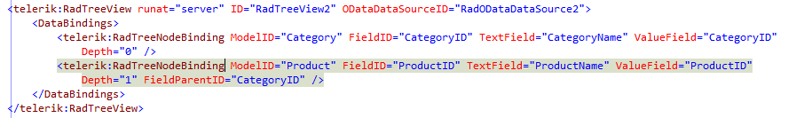

# Manual Hierarchy of RadTreeView

## 

In order to implement self-reference binding we decided to separate the very hierarchy from the data source. Here is the basic concept:

First we declare data model(s) in the data source -there is no need to specify any hierarchy there but only one or few models. Then, in the control that we want to bind we build the hierarchy from the available data model(s) - using different data model for each level of hierarchy.

You can consider the following scenario:

In the Northwind table there are Categories and Products tables. We are given the task to display all categories in the first level of the hierarchy and their respective Products in the second:

* Category 1

* Product 1.1

* Product 1.2

* Product 1.3

* Category 2

* Product 2.1

* Product 2.2

* Product 2.3

As you see, this case is quite more complicated because we need to query two different tables (entities), we have different DataText/DataValue fields for each level and the tables must have one to many relationship (in the language of OData, the Product model must have navigation property of Category) so that one can choose proper DataParentKeyField (for example CategoryID in the case of Products)

In order to implement it, we use the DataBindings properties available in RadTreeView. Put simply, these bindings describe DataText/Value and tons of other properties for each level of hierarchy. We can simply add ModelID, FieldID and FieldParentID to the DataBindingsin order to specify the correct entity for each level. Consider the following markup:

Thus, we define the model for the first level, its respective text and value field and then do the same for the second level. Please note that we have set ParentKeyField on the second level.
