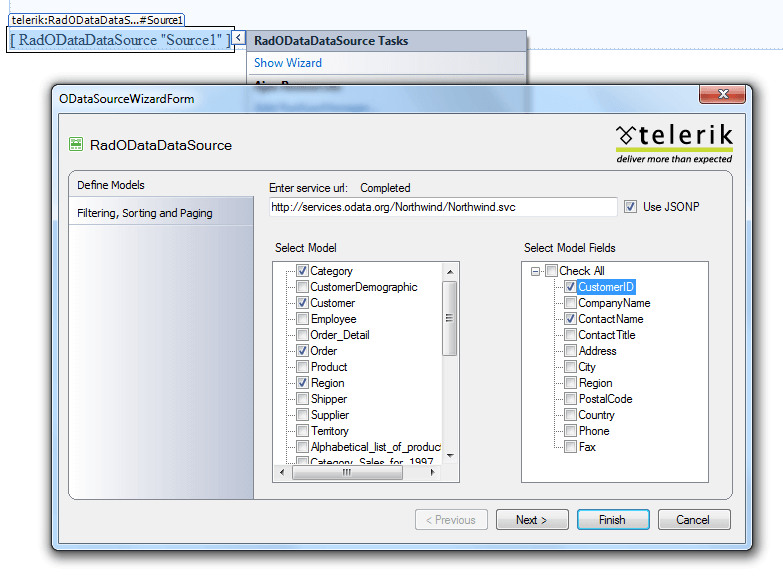
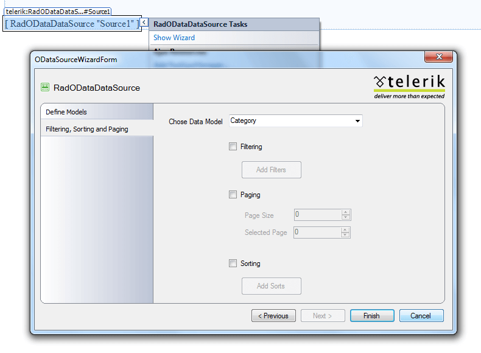
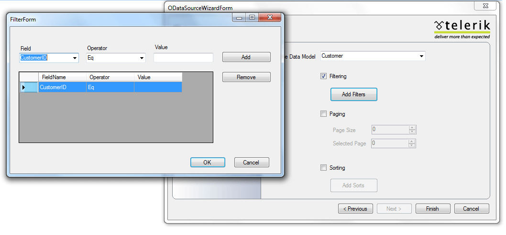

# Design Time

## 

The designer is the most important part of the control. One can easily configure the data and later bind it to the desired control. There are 2 steps in the wizard that will help you to easily configure the RadODataDataSource:

1. In the first step of the wizard you will need to enter the location of service in the **Enter service url** field. Then you will have the option to select the data fields/properties which will be used in the data model. *Next* button will be enabled only after at least one property is selected.

1. In the final screen you have a list of options to enable or disable sorting, filtering and paging:

* **Sorting** - You can easily configure your sorting by using the checkbox. The *Add Sorts* button opens a SortForm that enables you to further configure your sort expressions.

* **Filtering** - Filtering is the same as Sorting, but with different choosers in the *FilterForm*.

* **Paging** – Using the checkbox you can enable/disable paging. You can also set PageSize and CurrentPageIndex using textboxes.

