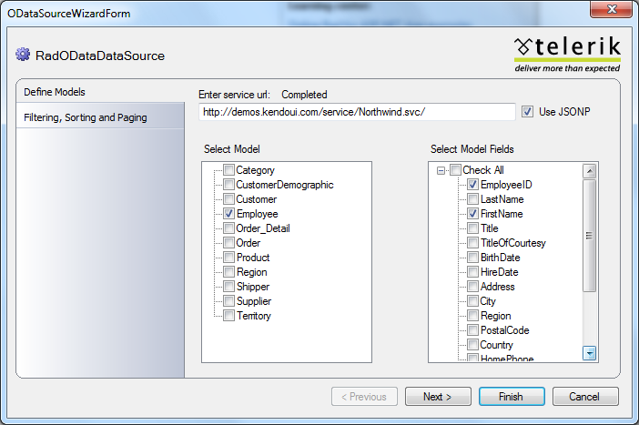
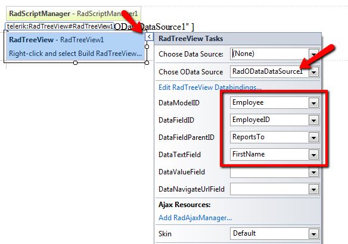

# Getting Started

In this topic, we will show how to recreate the First Look demo of RadODataDataSource entirely from the Design Time Wizards of the controls involved.

## 

1. From the Toolbox in Visual Studio, drag a RadODataDataSource and a RadTreeView instances to the design surface of your page.

1. Use the smart tag of RadODataDataSource to bring up the Design Time Wizard of the control.

1. Enter the service url. In this demo we use -*http://demos.kendoui.com/service/Northwind.svc/*.

1. From the 'Model' tree that is shown after step 3, choose 'Employee'.

1. From the ‘Model Fields’ tree that is shown after step 4 above, choose 'EmployeeID', 'FirstName', and 'ReportsTo'.

1. Click on the smart tag of RadTreeView and specify the OData source and the data fields of the control as shown below:

1. We are ready to view the page in the browser
