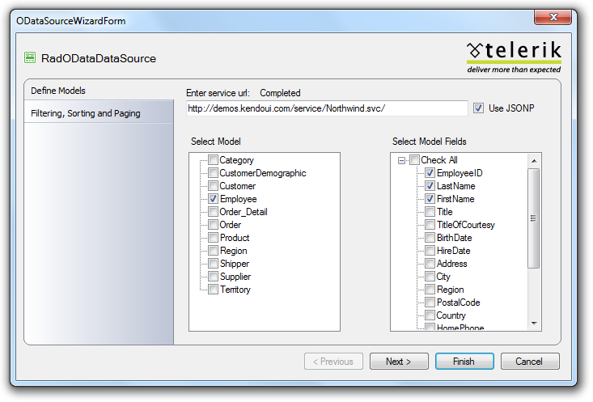

# Hierarchical Self-Reference Binding of RadTreeView 

## 

In order to implement self-reference binding we decided to separate the very hierarchy from the data source. Here is the basic concept:

First we declare data model(s) in the data source -there is no need to specify any hierarchy there but only one or few models. Then, in the control that we want to bind we build the hierarchy from the available data model(s) - using a single data model - when we deal with self-reference hierarchy.

Here is an example of hierarchical self-referenced binding using the Employees table from the Northwind database. Following the steps below one can easily configure the data source and bind it to the RadTreeView control:

1. In the first step you need to place RadODataDataSource and RadTreeView on the page.

1. Then you can use the RadODataDataSource designer and query the Northwind service url.

1. From the list of tables chose Employees and EmployeeID, LastName, FirstName, ReportsTo:

1. Click on finish.

Configuring the RadTreeView control:

1. Using the Smart tag, click on Chose OData Source and select the source that you configured in the previous steps. You shall be viewing something like the following screen:

>note Please note that in OData binding scenarios instead of DataFieldID there will be DataModel drop down.
>

1. The rest is straightforward, simply pick the needed values, save and run the page.

