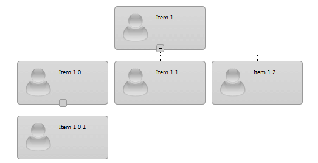
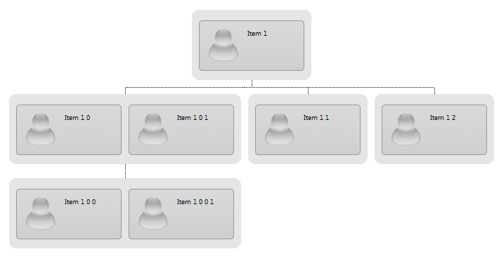
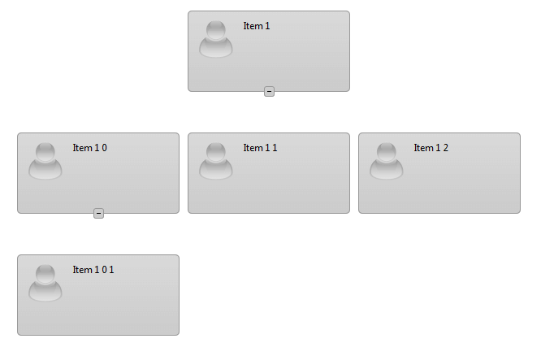
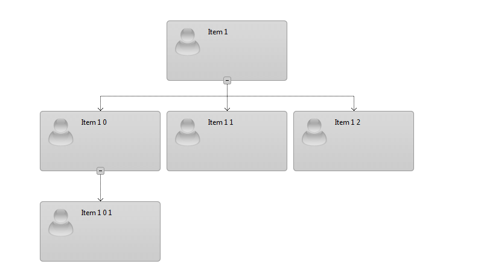

# Connecting Lines


## How to change the style of the connecting lines?

In case you would like to change the length of the connecting lines you can add styles as in the following code:

````ASPNET
  html .RadOrgChart .rocLineUp
{
	height:10px ;
	top: -10px;
}

html .RadOrgChart .rocLineDown
{
	height:10px;

}
html .RadOrgChart .rocLineHorizontal
{
	top: -10px;
}

html .RadOrgChart .rocNodeList
{
	margin: 20px auto 0;
}

.rocItem
{
	width:150px!important;
	height:70px!important;
}

.rocItemContent
{
	height:50px!important;
	font-size: 10px;
}
````



If you want to make the lines **invisible** you can use the code below:

````ASPNET
 .rocLineHorizontal, .rocLineUp, .rocLineDown
{
    visibility:hidden;
}
````



If you want to add arrows to the ends of the connecting lines you can add the following css styles:

````ASPNET
.rocLineUp:after 
{
    content: "";
    width: 9px;
    height: 5px;
    background: url("rocDownArrow.gif") no-repeat center center;
    position: absolute;
    bottom: 0;
    left: -4px;
}
	  
````


Such implementation is not supported in IE6 and IE7 browsers because they do not implement the **":after"** css selector.

