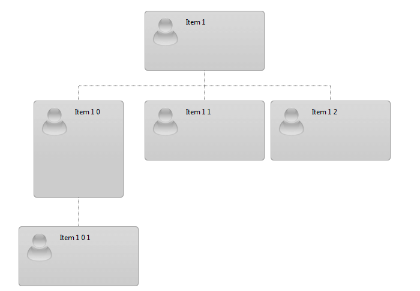
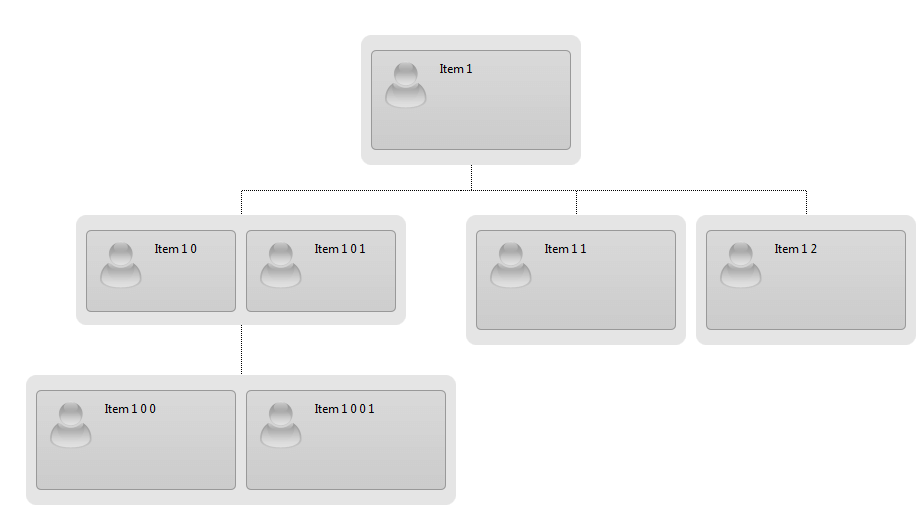

# Node Size


## How to change the size of some nodes?

In case you would like to set a different size of a node, you can change it by adding a specific **CssClass** to the node or groupItem.


This appearance can be achieved in the NodeDataBound event by association the index as it is shown in the following code:

* In Simple Binding:

````ASPNET
<style type="text/css"> 
	.newItemSizeSimple
	{
		width:150px !important;
		height:160px !important;
	}

	.newItemSizeSimple .rocItemContent
	{
		height:140px !important;
	}
</style>
  <telerik:RadOrgChart RenderMode="Lightweight" runat="server" ID="RadOrgChart1"
    OnNodeDataBound="RadOrgChart1_NodeDataBound">
</telerik:RadOrgChart>
````


````C#
protected void RadOrgChart1_NodeDataBound(object sender, Telerik.Web.UI.OrgChartNodeDataBoundEventArguments e)
{
    if (e.Node.ID == "2")
        foreach (var groupItem in e.Node.GroupItems)
            groupItem.CssClass = "newItemSizeSimple";
}


protected void Page_Init(object sender, EventArgs e)
{
    DataTable table = new DataTable();
    table.Columns.Add("ID");
    table.Columns.Add("ParentID");
    table.Columns.Add("Text");

    table.Rows.Add(new String[] { "1", null, "Item 1" });
    table.Rows.Add(new String[] { "2", "1", "Item 1 0" });
    table.Rows.Add(new String[] { "3", "1", "Item 1 1" });
    table.Rows.Add(new String[] { "4", "1", "Item 1 2" });
    table.Rows.Add(new String[] { "5", "2", "Item 1 0 1" });


    RadOrgChart1.DataFieldID = "ID";
    RadOrgChart1.DataFieldParentID = "ParentID";
    RadOrgChart1.DataTextField = "Text";
    RadOrgChart1.DataSource = table;
    RadOrgChart1.DataBind();

}	
````
````VB.NET
Protected Sub RadOrgChart1_NodeDataBound(sender As Object, e As Telerik.Web.UI.OrgChartNodeDataBoundEventArguments)
    If e.Node.ID = "2" Then
        For Each groupItem In e.Node.GroupItems
            groupItem.CssClass = "newItemSizeSimple"
        Next
    End If
End Sub


Protected Sub Page_Init(sender As Object, e As EventArgs)
    Dim table As New DataTable()
    table.Columns.Add("ID")
    table.Columns.Add("ParentID")
    table.Columns.Add("Text")

    table.Rows.Add(New [String]() {"1", Nothing, "Item 1"})
    table.Rows.Add(New [String]() {"2", "1", "Item 1 0"})
    table.Rows.Add(New [String]() {"3", "1", "Item 1 1"})
    table.Rows.Add(New [String]() {"4", "1", "Item 1 2"})
    table.Rows.Add(New [String]() {"5", "2", "Item 1 0 1"})

    RadOrgChart1.DataFieldID = "ID"
    RadOrgChart1.DataFieldParentID = "ParentID"
    RadOrgChart1.DataTextField = "Text"
    RadOrgChart1.DataSource = table
    RadOrgChart1.DataBind()

End Sub
````


* In Group-Enabled Binding:


````ASPNET
<style type="text/css"> 
	 .newItemSizeGroup .rocItem
	{
		width:150px !important;
		height:80px !important;
	}

.newItemSizeGroup .rocItemContent
{
    height:60px !important;
}
 </style>
<telerik:RadOrgChart RenderMode="Lightweight" runat="server" ID="RadOrgChart2"
    OnNodeDataBound="RadOrgChart2_NodeDataBound">
</telerik:RadOrgChart>
````


````C#
protected void RadOrgChart2_NodeDataBound(object sender, Telerik.Web.UI.OrgChartNodeDataBoundEventArguments e)
{
    if (e.Node.ID == "2")
        foreach (var groupItem in e.Node.GroupItems)
            groupItem.CssClass = "newItemSizeGroup";
}
protected void Page_Init(object sender, EventArgs e)
{
    DataTable table = new DataTable();
    table.Columns.Add("ID");
    table.Columns.Add("ParentID");
    table.Columns.Add("Text");

    table.Rows.Add(new String[] { "1", null, "Item 1" });
    table.Rows.Add(new String[] { "2", "1", "Item 1 0" });
    table.Rows.Add(new String[] { "3", "1", "Item 1 1" });
    table.Rows.Add(new String[] { "4", "1", "Item 1 2" });
    table.Rows.Add(new String[] { "5", "2", "Item 1 0 1" });

    DataTable items = new DataTable();
    items.Columns.Add("ID");
    items.Columns.Add("NodeID");
    items.Columns.Add("Text");

    items.Rows.Add(new String[] { "1", "1", "Item 1" });
    items.Rows.Add(new String[] { "2", "2", "Item 1 0" });
    items.Rows.Add(new String[] { "3", "2", "Item 1 0 1" });
    items.Rows.Add(new String[] { "4", "3", "Item 1 1" });
    items.Rows.Add(new String[] { "5", "4", "Item 1 2" });
    items.Rows.Add(new String[] { "6", "5", "Item 1 0 0" });
    items.Rows.Add(new String[] { "7", "5", "Item 1 0 0 1" });


    RadOrgChart2.GroupEnabledBinding.GroupItemBindingSettings.DataFieldID = "ID";
    RadOrgChart2.GroupEnabledBinding.GroupItemBindingSettings.DataFieldNodeID = "NodeID";
    RadOrgChart2.GroupEnabledBinding.GroupItemBindingSettings.DataTextField = "Text";
    RadOrgChart2.GroupEnabledBinding.GroupItemBindingSettings.DataSource = items;

    RadOrgChart2.GroupEnabledBinding.NodeBindingSettings.DataFieldID = "ID";
    RadOrgChart2.GroupEnabledBinding.NodeBindingSettings.DataFieldParentID = "ParentID";
    RadOrgChart2.GroupEnabledBinding.NodeBindingSettings.DataSource = table;
    RadOrgChart2.DataBind();
}
````
````VB.NET
Protected Sub RadOrgChart2_NodeDataBound(sender As Object, e As Telerik.Web.UI.OrgChartNodeDataBoundEventArguments)
    If e.Node.ID = "2" Then
        For Each groupItem As var In e.Node.GroupItems
            groupItem.CssClass = "newItemSizeGroup"
        Next
    End If
End Sub
Protected Sub Page_Init(sender As Object, e As EventArgs)
    Dim table As New DataTable()
    table.Columns.Add("ID")
    table.Columns.Add("ParentID")
    table.Columns.Add("Text")

    table.Rows.Add(New [String]() {"1", Nothing, "Item 1"})
    table.Rows.Add(New [String]() {"2", "1", "Item 1 0"})
    table.Rows.Add(New [String]() {"3", "1", "Item 1 1"})
    table.Rows.Add(New [String]() {"4", "1", "Item 1 2"})
    table.Rows.Add(New [String]() {"5", "2", "Item 1 0 1"})

    Dim items As New DataTable()
    items.Columns.Add("ID")
    items.Columns.Add("NodeID")
    items.Columns.Add("Text")

    items.Rows.Add(New [String]() {"1", "1", "Item 1"})
    items.Rows.Add(New [String]() {"2", "2", "Item 1 0"})
    items.Rows.Add(New [String]() {"3", "2", "Item 1 0 1"})
    items.Rows.Add(New [String]() {"4", "3", "Item 1 1"})
    items.Rows.Add(New [String]() {"5", "4", "Item 1 2"})
    items.Rows.Add(New [String]() {"6", "5", "Item 1 0 0"})
    items.Rows.Add(New [String]() {"7", "5", "Item 1 0 0 1"})


    RadOrgChart2.GroupEnabledBinding.GroupItemBindingSettings.DataFieldID = "ID"
    RadOrgChart2.GroupEnabledBinding.GroupItemBindingSettings.DataFieldNodeID = "NodeID"
    RadOrgChart2.GroupEnabledBinding.GroupItemBindingSettings.DataTextField = "Text"
    RadOrgChart2.GroupEnabledBinding.GroupItemBindingSettings.DataSource = items

    RadOrgChart2.GroupEnabledBinding.NodeBindingSettings.DataFieldID = "ID"
    RadOrgChart2.GroupEnabledBinding.NodeBindingSettings.DataFieldParentID = "ParentID"
    RadOrgChart2.GroupEnabledBinding.NodeBindingSettings.DataSource = table
    RadOrgChart2.DataBind()
End Sub
````

