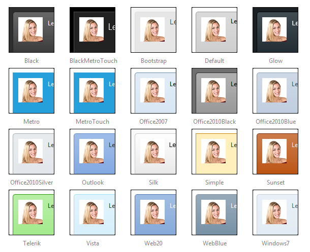

# Skins

## 

To make customizing the appearance of **RadOrgChart** as easy as possible, the control uses predefined skins. A skin is a set of images and a CSS stylesheets that can be applied to the elements (nodes, images, etc.) of the control and thus define their look and feel. To apply a skin to the **RadOrgchart**, set its Skin property, either using the properties pane or the RadOrgChart Smart Tag.

The control comes with a number of built-in skins:

>note The **Hay** , **Forest** , **Sitefinity** and **Transparent** skins are obsolete and have been removed from the Telerik.Web.UI.Skins.dll assembly as of **Q1 2014** .	You can find more information on the matter in[this blog post](http://blogs.telerik.com/aspnet-ajax/posts/13-04-11/6-telerik-asp.net-ajax-skins-going-obsolete).
>

