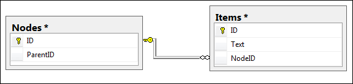

# Group-Enabled Binding


RadOrgChart supports grouping of items. The default (also called "simple") binding gives the ability to bind from self-referenced data. But when groups are required to represent a hierarchy, a single data source wouldn't be a good solution.

## 

RadOrgChart supports binding to hierarchical data including groups as logical entities. This is done with **Group-Enabled Binding**.

Group-Enabled Binding requires 2 separate data sources - **Node Datasource** and **Item Datasource**.

The idea behind this solution is to have as small repetition of data as possible. The Node Datasource contains self-referenced data, so the hiearchical structure can be created. All the data about the items is contained in the Item Datasource. The connection between the two is the **NodeID** field/column/property of the entities of the Item Datasource.

Here is a sample of a DB design:


And this is how one can bind RadOrgChart to the data:

````ASPNET

<telerik:RadOrgChart RenderMode="Lightweight" runat="server" ID="RadOrgChart1">
	<GroupEnabledBinding>
		<NodeBindingSettings DataSourceID="NodesDataSource" DataFieldID="ID" DataFieldParentID="ParentID" />
		<GroupItemBindingSettings DataSourceID="ItemsDataSource" DataFieldID="ID" DataFieldNodeID="NodeID"
			DataTextField="Text" />
	</GroupEnabledBinding>
</telerik:RadOrgChart>

<asp:SqlDataSource ID="ItemsDataSource" runat="server" ConnectionString="<%$ ConnectionStrings:RadOrgChartConnectionString %>"
	SelectCommand="SELECT * FROM [Items]"></asp:SqlDataSource>
<asp:SqlDataSource ID="NodesDataSource" runat="server" ConnectionString="<%$ ConnectionStrings:RadOrgChartConnectionString %>"
	SelectCommand="SELECT * FROM [Nodes]"></asp:SqlDataSource>
	
````


# See Also

 * [Group-Enabled Binding Demo](https://demos.telerik.com/aspnet-ajax/orgchart/examples/groupenabledbinding/defaultcs.aspx)
