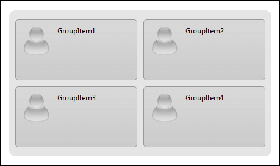
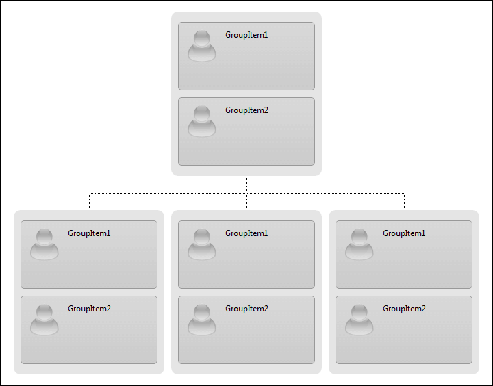
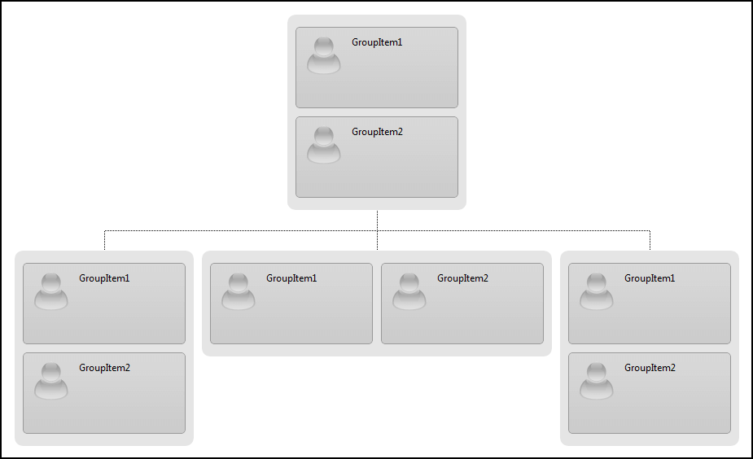

# Column Count


In order to provide more flexibility to visualizing of groups in the hierarchy,	RadOrgChart implements Column Count feature.

## What does Column Count do?

Column Count simply breaks the single-line presentation of the groups in RadOrgCharton multiple lines, through following the specified by the user number of columns in a group(how many Group Items are rendered on a single line/row).

One can specify what's the value of the Column Count for a certain OrgChartNode, by setting the Node.**ColumnCount** property.

Here is a sample of setting the property on OrgChartNode declared in the markup:

````ASPNET
<telerik:RadOrgChart RenderMode="Lightweight" runat="server" ID="RadOrgChart1">
	<Nodes>
		<telerik:OrgChartNode ColumnCount="2">
			<GroupItems>
				<telerik:OrgChartGroupItem Text="GroupItem1" />
				<telerik:OrgChartGroupItem Text="GroupItem2" />
				<telerik:OrgChartGroupItem Text="GroupItem3" />
				<telerik:OrgChartGroupItem Text="GroupItem4" />
			</GroupItems>
		</telerik:OrgChartNode>
	</Nodes>
</telerik:RadOrgChart>
````


And this is how the result look like:


## Is there a way to set Column Count for all nodes?

**There is such a way.**

It's property of RadOrgChart called GroupColumnCount and setting this property gives you the ability to control the ColumnCount from one place and at the same time removes the overhead of setting it to each and every node separately.

Here is an example:

````ASPNET
<telerik:RadOrgChart RenderMode="Lightweight" runat="server" ID="RadOrgChart2" GroupColumnCount="1">
	<Nodes>
		<telerik:OrgChartNode>
			<GroupItems>
				<telerik:OrgChartGroupItem Text="GroupItem1" />
				<telerik:OrgChartGroupItem Text="GroupItem2" />
			</GroupItems>
			<Nodes>
				<telerik:OrgChartNode>
					<GroupItems>
						<telerik:OrgChartGroupItem Text="GroupItem1" />
						<telerik:OrgChartGroupItem Text="GroupItem2" />
					</GroupItems>
				</telerik:OrgChartNode>
				<telerik:OrgChartNode>
					<GroupItems>
						<telerik:OrgChartGroupItem Text="GroupItem1" />
						<telerik:OrgChartGroupItem Text="GroupItem2" />
					</GroupItems>
				</telerik:OrgChartNode>
				<telerik:OrgChartNode>
					<GroupItems>
						<telerik:OrgChartGroupItem Text="GroupItem1" />
						<telerik:OrgChartGroupItem Text="GroupItem2" />
					</GroupItems>
				</telerik:OrgChartNode>
			</Nodes>
		</telerik:OrgChartNode>
	</Nodes>
</telerik:RadOrgChart>
````


And this is the result:


## What if we want to use both in combination?

Well, you simply **can**.

You can set on OrgChart-level (OrgChart.GroupColumnCount) the most repeatedly ocurringColumn Count, and then set it locally to smaller part of nodes that require a different number of columns.

Here is an example:

````ASPNET
<telerik:RadOrgChart RenderMode="Lightweight" runat="server" ID="RadOrgChart3" GroupColumnCount="1">
	<Nodes>
		<telerik:OrgChartNode>
			<GroupItems>
				<telerik:OrgChartGroupItem Text="GroupItem1" />
				<telerik:OrgChartGroupItem Text="GroupItem2" />
			</GroupItems>
			<Nodes>
				<telerik:OrgChartNode>
					<GroupItems>
						<telerik:OrgChartGroupItem Text="GroupItem1" />
						<telerik:OrgChartGroupItem Text="GroupItem2" />
					</GroupItems>
				</telerik:OrgChartNode>
				<telerik:OrgChartNode ColumnCount="2">
					<GroupItems>
						<telerik:OrgChartGroupItem Text="GroupItem1" />
						<telerik:OrgChartGroupItem Text="GroupItem2" />
					</GroupItems>
				</telerik:OrgChartNode>
				<telerik:OrgChartNode>
					<GroupItems>
						<telerik:OrgChartGroupItem Text="GroupItem1" />
						<telerik:OrgChartGroupItem Text="GroupItem2" />
					</GroupItems>
				</telerik:OrgChartNode>
			</Nodes>
		</telerik:OrgChartNode>
	</Nodes>
</telerik:RadOrgChart>
````


And this is how the result look like:


# See Also

 * [Templates (demo)](https://demos.telerik.com/aspnet-ajax/orgchart/examples/templates/defaultcs.aspx)

 * [Column count (demo)](https://demos.telerik.com/aspnet-ajax/orgchart/examples/columncount/defaultcs.aspx)

 * [Templates (article)]()
