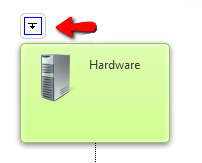
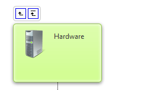

# Drill Down

## Drill Down

__Drill Down__ functionality gives the ability to observe only a specific branch of the hierarchy of__RadOrgChart__. When the user clicks on the __"DrillDown"__ icon a postback is performed and the subset of nodes is displayed.

There is also a possiblity to navigate to the parent Node or to the root Node by clicking on one of the following icons.

__Properties:__

The functionality could be enabled by setting the __EnableDrillDown__ property to__true__.
