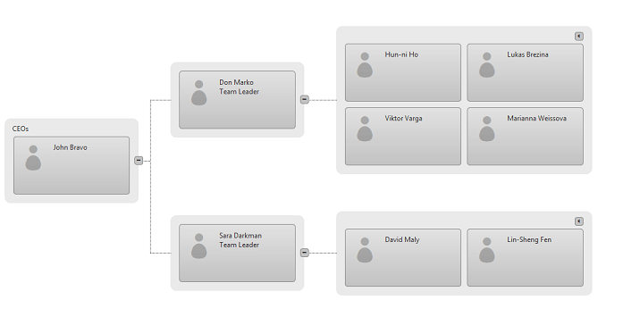
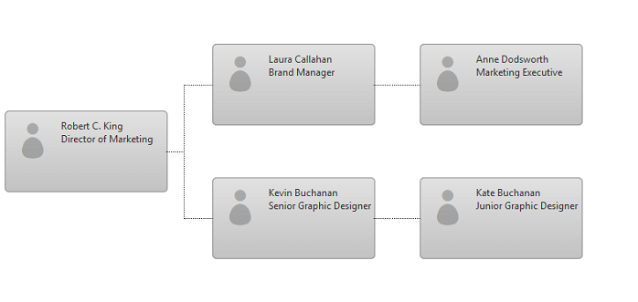

# Horizontal Orientation


## 

**Horizontal Orientation** is a new feature available in **RadOrgChart** since Q1 2015 release. Setting the **RadOrgChart**'s **Orientation** property to **Horizontal** expands all Nodes horizontally. This feature is available if the control's [Lightweight RenderMode]() is selected.

The following examples demonstrate how to use **Horizontal Orientation** with Items Grouping and SimpleBinding.
>caption Figure 1: Horizontal Orientation of RadOrgChart with Items Grouping



````ASPNET
<telerik:RadOrgChart runat="server" ID="RadOrgChart1" RenderMode="Lightweight" Orientation="Horizontal"
    EnableCollapsing="true" EnableDrillDown="true" EnableGroupCollapsing="true">
    <Nodes>
        <telerik:OrgChartNode>
            <RenderedFields>
                <telerik:OrgChartRenderedField Text="CEOs" />
            </RenderedFields>
            <GroupItems>
                <telerik:OrgChartGroupItem Text="John Bravo" />
            </GroupItems>
            <Nodes>
                <telerik:OrgChartNode>
                    <GroupItems>
                        <telerik:OrgChartGroupItem Text="Don Marko">
                            <RenderedFields>
                                <telerik:OrgChartRenderedField Text="Team Leader" />
                            </RenderedFields>
                        </telerik:OrgChartGroupItem>
                    </GroupItems>
                    <Nodes>
                        <telerik:OrgChartNode ColumnCount="2">
                            <GroupItems>
                                <telerik:OrgChartGroupItem Text="Hun-ni Ho" />
                                <telerik:OrgChartGroupItem Text="Lukas Brezina" />
                                <telerik:OrgChartGroupItem Text="Viktor Varga" />
                                <telerik:OrgChartGroupItem Text="Marianna Weissova" />
                            </GroupItems>
                        </telerik:OrgChartNode>
                    </Nodes>
                </telerik:OrgChartNode>
                <telerik:OrgChartNode>
                    <GroupItems>
                        <telerik:OrgChartGroupItem Text="Sara Darkman">
                            <RenderedFields>
                                <telerik:OrgChartRenderedField Text="Team Leader" />
                            </RenderedFields>
                        </telerik:OrgChartGroupItem>
                    </GroupItems>
                    <Nodes>
                        <telerik:OrgChartNode ColumnCount="2">
                            <GroupItems>
                                <telerik:OrgChartGroupItem Text="David Maly" />
                                <telerik:OrgChartGroupItem Text="Lin-Sheng Fen" />
                            </GroupItems>
                        </telerik:OrgChartNode>
                    </Nodes>
                </telerik:OrgChartNode>
            </Nodes>
        </telerik:OrgChartNode>
    </Nodes>
</telerik:RadOrgChart>
````


>caption Figure 2: Horizontal Orientation of RadOrgChart in SimpleBinding



````ASPNET
<telerik:RadAjaxPanel runat="server" ID="RadAjaxPanel" LoadingPanelID="RadAjaxLoadingPanel1">
    <asp:HiddenField runat="server" ID="SessionID" />
    <telerik:RadOrgChart ID="RadOrgChart1" runat="server" RenderMode="Lightweight" Orientation="Horizontal" DataFieldID="EmployeeID" DataFieldParentID="ReportsTo"
        DataTextField="FullName">
    </telerik:RadOrgChart>
</telerik:RadAjaxPanel>
````


````C#	
private DataTable employees;

protected override void OnInit(EventArgs e)
{
    //added to prevent incorrect reorder (e.g if it is navigated to another page and returns with back button - IE issue)
    Response.Cache.SetCacheability(HttpCacheability.NoCache);

    base.OnInit(e);
}

protected void Page_Load(object sender, EventArgs e)
{
    Session.Timeout = 30;
    if (!IsPostBack)
    {
        //avoiding sharing Session variables between tabs in one browser
        SessionID.Value = Guid.NewGuid().ToString();
    }

    RadOrgChart1.NodeDrop += new Telerik.Web.UI.OrgChartNodeDropEventHandler(RadOrgChart1_NodeDrop);

    if (Session[SessionID.Value + "EmployeesSimpleBindingCS"] == null || !IsPostBack)
    {
        CreateEmployees();
    }
    else
        employees = Session[SessionID.Value + "EmployeesSimpleBindingCS"] as DataTable;

    RadOrgChart1.RenderedFields.ItemFields.Add(new Telerik.Web.UI.OrgChartRenderedField() { DataField = "Position" });
    RadOrgChart1.DataSource = employees;
    RadOrgChart1.DataBind();
}

private void CreateEmployees()
{
    employees = new DataTable();
    employees.Columns.Add("EmployeeID");
    employees.Columns.Add("ReportsTo");
    employees.Columns.Add("FullName");
    employees.Columns.Add("Position");

    employees.Rows.Add(new string[] { "1", null, "Robert C. King", "Director of Marketing" });
    employees.Rows.Add(new string[] { "2", "1", "Laura Callahan", "Brand Manager" });
    employees.Rows.Add(new string[] { "3", "2", "Anne Dodsworth", "Marketing Executive" });
    employees.Rows.Add(new string[] { "4", "1", "Kevin Buchanan", "Senior Graphic Designer" });
    employees.Rows.Add(new string[] { "5", "4", "Kate Buchanan", "Junior Graphic Designer" });
    Session[SessionID.Value + "EmployeesSimpleBindingCS"] = employees;
}

void RadOrgChart1_NodeDrop(object sender, Telerik.Web.UI.OrgChartNodeDropEventArguments e)
{
    var rows = from myRow in employees.AsEnumerable() where myRow.Field<string>("EmployeeID") == e.SourceNode.ID select new { values = myRow };

    foreach (var row in rows)
    {
        row.values.SetField<string>("ReportsTo", e.DestinationNode.ID);
    }

    Session[SessionID.Value + "EmployeesSimpleBindingCS"] = employees;

    RadOrgChart1.DataBind();
}
````


# See Also

 * [Render Modes article]()
