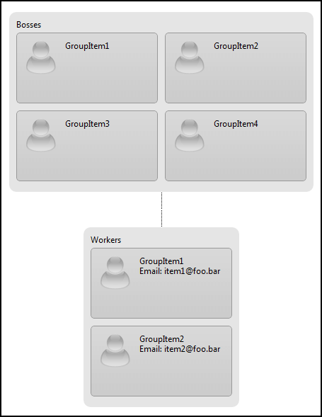

# XML Export & Import


RadOrgChart supports Export and Import to XML data.

## XML Export

Here is sample OrgChart declaration:

````ASPNET
<telerik:RadOrgChart RenderMode="Lightweight" runat="server" ID="RadOrgChart1" GroupColumnCount="2">
	<Nodes>
		<telerik:OrgChartNode>
			<RenderedFields>
				<telerik:OrgChartRenderedField Text="Bosses" />
			</RenderedFields>
			<GroupItems>
				<telerik:OrgChartGroupItem Text="GroupItem1" />
				<telerik:OrgChartGroupItem Text="GroupItem2" />
				<telerik:OrgChartGroupItem Text="GroupItem3" />
				<telerik:OrgChartGroupItem Text="GroupItem4" />
			</GroupItems>
			<Nodes>
				<telerik:OrgChartNode ColumnCount="1">
					<RenderedFields>
						<telerik:OrgChartRenderedField Text="Workers" />
					</RenderedFields>
					<GroupItems>
						<telerik:OrgChartGroupItem Text="GroupItem1">
							<RenderedFields>
								<telerik:OrgChartRenderedField Text="Email: item1@foo.bar" />
							</RenderedFields>
						</telerik:OrgChartGroupItem>
						<telerik:OrgChartGroupItem Text="GroupItem2">
							<RenderedFields>
								<telerik:OrgChartRenderedField Text="Email: item2@foo.bar" />
							</RenderedFields>
						</telerik:OrgChartGroupItem>
					</GroupItems>
				</telerik:OrgChartNode>
			</Nodes>
		</telerik:OrgChartNode>
	</Nodes>
</telerik:RadOrgChart>
````


And this is the result of calling OrgChart.GetXml() method:

````XML
<?xml version="1.0" encoding="utf-16"?>
<RadOrgChart GroupColumnCount="2">
	<Nodes>
		<Node>
			<Fields>
				<Field Text="Bosses" />
			</Fields>
			<Items>
				<Item Text="GroupItem1" />
				<Item Text="GroupItem2" />
				<Item Text="GroupItem3" />
				<Item Text="GroupItem4" />
			</Items>
			<Nodes>
				<Node ColumnCount="1">
					<Fields>
						<Field Text="Workers" />
					</Fields>
					<Items>
						<Item Text="GroupItem1">
							<Fields>
								<Field Text="Email: item1@foo.bar" />
							</Fields>
						</Item>
						<Item Text="GroupItem2">
							<Fields>
								<Field Text="Email: item2@foo.bar" />
							</Fields>
						</Item>
					</Items>
				</Node>
			</Nodes>
		</Node>
	</Nodes>
</RadOrgChart>
````


## XML Import

The reverse process is also implemented - XML Import (LoadXml).

If there were 2 OrgChart declarations in the above sample (second one empty), it's that simple to reload the first in the second one:

````C#
RadOrgChart2.LoadXml(RadOrgChart1.GetXml());
````


The result would be 2 OrgCharts, looking exactly like this:


# See Also

 * [Online Demo](https://demos.telerik.com/aspnet-ajax/orgchart/examples/populatingwithdata/xmlfile/defaultcs.aspx)
