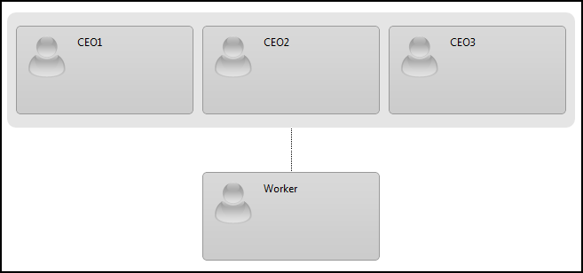

# Nodes and Items


During the design of RadOrgChart, two main types of objects were identified - **Nodes** and **Items**.

## What's what?

Organizational hierarchies mostly include relations of type **person-managing-person**:

But there also are cases in which a department of people is represented by a single node in the tree structure:

That is why we came up with the following object model:

* **RadOrgChart**

* NodesCollection

* **Node**

* NodesCollection

* GroupItemsCollection

* **GroupItem**

In this model, **Node's** purpose is to hold GroupItems. In case that a node holds a single GroupItem - this node is **not** considered *Group*. In the first example none of the items presented didn't have the visual representation of a group - the rounded rectangle with a background is missing:

## What's a Group?

**A group is a single Node holding more than 1 GroupItem.**

Adding more than one item to a single node will result in the creation of a group.

## Is there a way to have a group with only 1 GroupItem?

The only way to have a group with 1 item, would be to have at least one Rendered Field (see [Rendered Fields]()) set to the node representing the group.

Having a rendered field on Node level, states, that the node should be visibly represented and this only makes sense if the node is representing an actual group.

Here is an example that will illustrate the case of single-item group:

````ASPNET
	
				<telerik:RadOrgChart runat="server" ID="RadOrgChart1">
					<Nodes>
						<telerik:OrgChartNode>
							<RenderedFields>
								<telerik:OrgChartRenderedField Text="Group's Name" />
							</RenderedFields>
							<GroupItems>
								<telerik:OrgChartGroupItem Text="Only Item of the group" />
							</GroupItems>
						</telerik:OrgChartNode>
					</Nodes>
				</telerik:RadOrgChart>
	
````


And this is how the results looks like:
