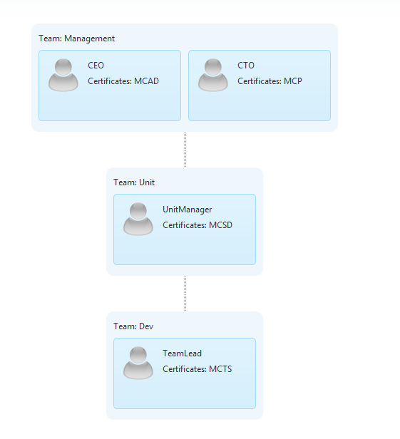

# Overview Overview

## 

Telerik **RadOrgChart** for ASP.NET AJAX is a flexible organizational chart control for ASP.NET applications.

It is specially designed to represent a structure of an organization in terms of relationships among personnel and/or departments.

It is a powerful and at the same time easy-to-use control that represents data in the most intuitive way so that the final user can understand the structure of an organization at a single glance. The **RadOrgChart** control introduces a number of advanced features, including:

* [Easy to setup data binding, supporting rich variety of data sources]();

* [Server-side events for customizing behavior;]()

* [Customizable appearance of the nodes by using templates]().

* [Flexible rendering engine]().

This control provides the best way to visualize and understand your workforce by simple and easy to illustrate hierarchical relationships.

It's specifically designed in order to help the final user creates diagrams for different human resources – this could be management, staff organization, office administration, management structures and as well as many more.

Very important is to note that there is also a default image rendering. This means that if an image is not present or not set, the rendering algorithm will search for a default image set through the property RadOrgChart.DefaultImageUrl. If, however, this property is also not set, a default (for RadOrgChart) image will be rendered. Default images can be stopped from the RadOrgChart.DisableDefaultImages property.

# See Also

 * [Online Demo](http://demos.telerik.com/aspnet-ajax/orgchart/examples/overview/defaultcs.aspx)
