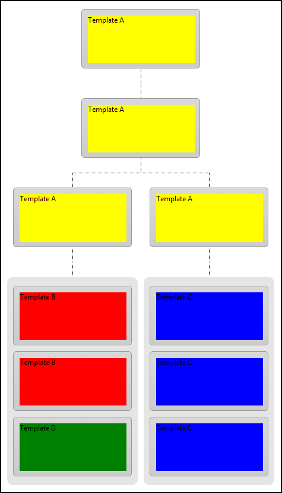

# Templates Overview


## 

**RadOrgChart** is highly customizable. Besides the built-in skins that you can apply you can customize the appearance of the nodes by using templates. For example if the sizes of images does not apply to already collected number of employee profile pictures, a template can be created without the restrain of 48x48 pixels (which is the default image size for RadOrgChart). When a template is used the rendered fields of the GroupItem are not applied.

In order to facilitate that we have implemented a **3-level** templating engine giving the power of applying templates on:

1. **OrgChart level (ItemTemplate)** - for all items that doesn't have template nor does their node;

2. **Node level (ItemTemplate)** - for all items within the node which doesn't have template;

3. **GroupItem level (simply Template)** - for the item, with disregard of node or global (OrgChart.ItemTemplate) template.

Here is an example that demonstrates how the above mentioned templates can be applied:

````ASPNET
			
<telerik:RadOrgChart RenderMode="Lightweight" runat="server" ID="RadOrgChart1" Skin="Default" GroupColumnCount="1">
	<ItemTemplate>
		<div style="background-color: Yellow; height: 80px; width: 180px;">
			Template A</div>
	</ItemTemplate>
	<Nodes>
		<telerik:OrgChartNode>
			<GroupItems>
				<telerik:OrgChartGroupItem Text="CEO">
				</telerik:OrgChartGroupItem>
			</GroupItems>
			<Nodes>
				<telerik:OrgChartNode>
					<GroupItems>
						<telerik:OrgChartGroupItem Text="UnitManager" />
					</GroupItems>
					<Nodes>
						<telerik:OrgChartNode>
							<GroupItems>
								<telerik:OrgChartGroupItem Text="TeamLeader1" />
							</GroupItems>
							<Nodes>
								<telerik:OrgChartNode>
									<ItemTemplate>
										<div style="background-color: Red; height: 80px; width: 180px;">
											Template B</div>
									</ItemTemplate>
									<GroupItems>
										<telerik:OrgChartGroupItem Text="Member1" />
										<telerik:OrgChartGroupItem Text="Member2" />
										<telerik:OrgChartGroupItem Text="TechnicalLeader">
											<Template>
												<div style="background-color: Green; height: 80px; width: 180px;">
													Template D</div>
											</Template>
										</telerik:OrgChartGroupItem>
									</GroupItems>
								</telerik:OrgChartNode>
							</Nodes>
						</telerik:OrgChartNode>
						<telerik:OrgChartNode>
							<GroupItems>
								<telerik:OrgChartGroupItem Text="TeamLeader2" />
							</GroupItems>
							<Nodes>
								<telerik:OrgChartNode>
									<ItemTemplate>
										<div style="background-color: Blue; height: 80px; width: 180px;">
											Template C</div>
									</ItemTemplate>
									<GroupItems>
										<telerik:OrgChartGroupItem Text="Member1" />
										<telerik:OrgChartGroupItem Text="Member2" />
										<telerik:OrgChartGroupItem Text="Member3" />
									</GroupItems>
								</telerik:OrgChartNode>
							</Nodes>
						</telerik:OrgChartNode>
					</Nodes>
				</telerik:OrgChartNode>
			</Nodes>
		</telerik:OrgChartNode>
	</Nodes>
</telerik:RadOrgChart>
			
````


Here is how the above code will look like:



## 

Here is an example that demonstrates how to add dynamically a template:

````ASPNET

<telerik:RadOrgChart RenderMode="Lightweight" runat="server" ID="RadOrgChart2">
</telerik:RadOrgChart>

````


````C#
	
var node = new OrgChartNode();
var item = new OrgChartGroupItem() { Template = new LabelTemplate() };

node.GroupItems.Add(item);
RadOrgChart2.Nodes.Add(node);
	
````
````VB.NET
	
Dim node = New OrgChartNode()
Dim item = New OrgChartGroupItem() With {.Template = New LabelTemplate()}

node.GroupItems.Add(item)
RadOrgChart2.Nodes.Add(node)
	
````


````C#
	
class LabelTemplate : ITemplate
{
    public void InstantiateIn(Control container)
    {
        Label label1 = new Label();
        label1.ID = "ItemLabel";
        label1.Text = "Text";
        label1.Font.Size = 10;
        label1.Font.Bold = true;

        container.Controls.Add(label1);
    }
}
	
````
````VB.NET
	
Class LabelTemplate
    Implements ITemplate


    Public Sub InstantiateIn(container As Control) Implements System.Web.UI.ITemplate.InstantiateIn
        Dim label1 As New Label()
        label1.ID = "ItemLabel"
        label1.Text = "Text"
        label1.Font.Size = 10
        label1.Font.Bold = True

        container.Controls.Add(label1)
    End Sub
End Class
	
````


## 

Here is an example that demonstrates how to evaluate a template. Please keep in mind that the **Container** is the object reference against which the expression is evaluated and the **Container.DataItem** is the reference to row from the data source to which the item is bound.

````C#

<telerik:RadOrgChart RenderMode="Lightweight" runat="server" ID="RadOrgChart3" DataFieldID="ID" DataFieldParentID="ParentID">
    <ItemTemplate>
        <span>Identifier: <%#Eval("ID")%></span>
        <br />
        <span>Name: <%#DataBinder.Eval(Container.DataItem, "Name")%></span>
        <br />
        <span>Location: <%#DataBinder.Eval(Container.DataItem, "Location")%></span>
    </ItemTemplate>
</telerik:RadOrgChart>

````


````C#
	
RadOrgChart3.DataSource = GetDataSource();
RadOrgChart3.DataBind();
	
````
````VB.NET
	
RadOrgChart3.DataSource = GetDataSource()
RadOrgChart3.DataBind()
	
````


````C#
	
private DataTable GetDataSource()
{
    DataTable table = new DataTable();
    table.Columns.Add("ID");
    table.Columns.Add("ParentID");
    table.Columns.Add("Name");
    table.Columns.Add("Location");

    table.Rows.Add(new string[] { "1", null, "Peter", "Sofia" });
    table.Rows.Add(new string[] { "2", "1", "Nick", "London" });
    table.Rows.Add(new string[] { "3", "1", "Kate", "Vienna" });
    table.Rows.Add(new string[] { "4", "3", "Kelly", "New York" });

    return table;
}
	
````
````VB.NET
	
Private Function GetDataSource() As DataTable
    Dim table As New DataTable()
    table.Columns.Add("ID")
    table.Columns.Add("ParentID")
    table.Columns.Add("Name")
    table.Columns.Add("Location")

    table.Rows.Add(New String() {"1", Nothing, "Peter", "Sofia"})
    table.Rows.Add(New String() {"2", "1", "Nick", "London"})
    table.Rows.Add(New String() {"3", "1", "Kate", "Vienna"})
    table.Rows.Add(New String() {"4", "3", "Kelly", "New York"})

    Return table
End Function
	
````


# See Also

 * [Online Demo](https://demos.telerik.com/aspnet-ajax/orgchart/examples/templates/defaultcs.aspx)
