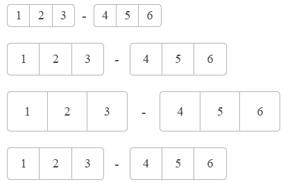
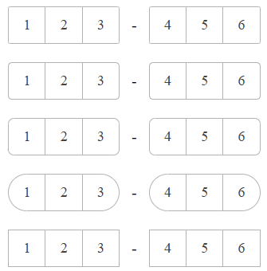
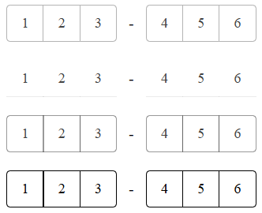
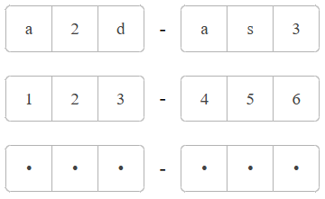

# Appearance

In this article, you will find information about the styling options and rendering of the WebForms OTPInput.

For a live example, visit the [Appearance Demo of the OTPInput](https://demos.telerik.com/aspnet-ajax/otpinput/appearance/defaultcs.aspx).

## Options

The WebForms OTPInput supports the following styling options:

- [`Size`](#size) - configures the overall size of the component.
- [`FillMode`](#fillmode) - configures how the color is applied to the component.
- [`Rounded`](#rounded) - configures the border radius of the component.

### Size

The `Size` option controls how big or small the items of the OTPInput look.



The following values are available for the [Size]() option: 

- `Small`
- `Medium` (Default)
- `Large`
- `None`

Example

````ASP.NET
<telerik:RadOTPInput ID="RadOTPInput1" runat="server" Size="Small" Separator="-">
    <ItemsCollection>
        <telerik:OTPInputItem GroupLength="3" />
        <telerik:OTPInputItem GroupLength="3" />
    </ItemsCollection>
</telerik:RadOTPInput>

<telerik:RadOTPInput ID="RadOTPInput2" runat="server" Size="Medium" Separator="-">
    <ItemsCollection>
        <telerik:OTPInputItem GroupLength="3" />
        <telerik:OTPInputItem GroupLength="3" />
    </ItemsCollection>
</telerik:RadOTPInput>

<telerik:RadOTPInput ID="RadOTPInput3" runat="server" Size="Large" Separator="-">
    <ItemsCollection>
        <telerik:OTPInputItem GroupLength="3" />
        <telerik:OTPInputItem GroupLength="3" />
    </ItemsCollection>
</telerik:RadOTPInput>

<telerik:RadOTPInput ID="RadOTPInput4" runat="server" Size="None" Separator="-">
    <ItemsCollection>
        <telerik:OTPInputItem GroupLength="3" />
        <telerik:OTPInputItem GroupLength="3" />
    </ItemsCollection>
</telerik:RadOTPInput>
````

### Rounded

The `Rounded` option controls the border radius of the rendered `input` elements. 



The following values are available for the [Rounded]() option:

- `Small`
- `Mediun` (Default)
- `Large`
- `Full`
- `None`

````ASP.NET
<telerik:RadOTPInput ID="RadOTPInput1" runat="server" Rounded="Small" Separator="-">
    <ItemsCollection>
        <telerik:OTPInputItem GroupLength="3" />
        <telerik:OTPInputItem GroupLength="3" />
    </ItemsCollection>
</telerik:RadOTPInput>

<telerik:RadOTPInput ID="RadOTPInput2" runat="server" Rounded="Medium" Separator="-">
    <ItemsCollection>
        <telerik:OTPInputItem GroupLength="3" />
        <telerik:OTPInputItem GroupLength="3" />
    </ItemsCollection>
</telerik:RadOTPInput>

<telerik:RadOTPInput ID="RadOTPInput3" runat="server" Rounded="Large" Separator="-">
    <ItemsCollection>
        <telerik:OTPInputItem GroupLength="3" />
        <telerik:OTPInputItem GroupLength="3" />
    </ItemsCollection>
</telerik:RadOTPInput>

<telerik:RadOTPInput ID="RadOTPInput4" runat="server" Rounded="Full" Separator="-">
    <ItemsCollection>
        <telerik:OTPInputItem GroupLength="3" />
        <telerik:OTPInputItem GroupLength="3" />
    </ItemsCollection>
</telerik:RadOTPInput>

<telerik:RadOTPInput ID="RadOTPInput5" runat="server" Rounded="None" Separator="-">
    <ItemsCollection>
        <telerik:OTPInputItem GroupLength="3" />
        <telerik:OTPInputItem GroupLength="3" />
    </ItemsCollection>
</telerik:RadOTPInput>
````

### FillMode

The `FillMode` option controls the way the color is applied to the rendered `input` elements.



The following values are available for the [FillMode]() option:

- `Solid` (Default)
- `Flat`
- `Outline`
- `None`

````ASP.NET
<telerik:RadOTPInput ID="RadOTPInput1" runat="server" FillMode="Solid" Separator="-">
    <ItemsCollection>
        <telerik:OTPInputItem GroupLength="3" />
        <telerik:OTPInputItem GroupLength="3" />
    </ItemsCollection>
</telerik:RadOTPInput>

<telerik:RadOTPInput ID="RadOTPInput2" runat="server" FillMode="Flat" Separator="-">
    <ItemsCollection>
        <telerik:OTPInputItem GroupLength="3" />
        <telerik:OTPInputItem GroupLength="3" />
    </ItemsCollection>
</telerik:RadOTPInput>

<telerik:RadOTPInput ID="RadOTPInput3" runat="server" FillMode="Outline" Separator="-">
    <ItemsCollection>
        <telerik:OTPInputItem GroupLength="3" />
        <telerik:OTPInputItem GroupLength="3" />
    </ItemsCollection>
</telerik:RadOTPInput>

<telerik:RadOTPInput ID="RadOTPInput4" runat="server" FillMode="None" Separator="-">
    <ItemsCollection>
        <telerik:OTPInputItem GroupLength="3" />
        <telerik:OTPInputItem GroupLength="3" />
    </ItemsCollection>
</telerik:RadOTPInput>
````

### Type

The `Type` option controls the type of the `input` elements.



The following values are available for the [Type]() option:

- `Text` (Default)
- `Number`
- `Password`

````ASP.NET
<telerik:RadOTPInput ID="RadOTPInput1" runat="server" Type="Text" Separator="-">
    <ItemsCollection>
        <telerik:OTPInputItem GroupLength="3" />
        <telerik:OTPInputItem GroupLength="3" />
    </ItemsCollection>
</telerik:RadOTPInput>

<telerik:RadOTPInput ID="RadOTPInput2" runat="server" Type="Number" Separator="-">
    <ItemsCollection>
        <telerik:OTPInputItem GroupLength="3" />
        <telerik:OTPInputItem GroupLength="3" />
    </ItemsCollection>
</telerik:RadOTPInput>

<telerik:RadOTPInput ID="RadOTPInput3" runat="server" Type="Password" Separator="-">
    <ItemsCollection>
        <telerik:OTPInputItem GroupLength="3" />
        <telerik:OTPInputItem GroupLength="3" />
    </ItemsCollection>
</telerik:RadOTPInput>
````

## Next Steps

- [Separator]()
- [Adaptiveness]()
- [Accessibility]() 
- [Client-side Programming]()
- [Server-side Programming]()
