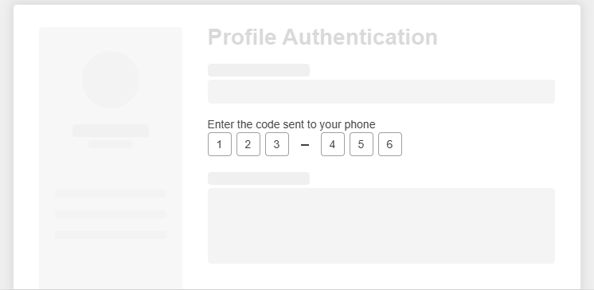

# WebForms OTPInput Overview

The OTPInput is a UI component that allows the user to enter a one-time password (OTP) during multi-factor authentication. Its sole purpose is to strengthen applications in terms of security while offering a seamless user experience during user interaction.

This component is a server-side, ASP.NET WebForms wrapper over the [Kendo UI OTPInput widget](https://www.telerik.com/kendo-jquery-ui/documentation/controls/otpinput/overview).





To see the otpinput in action, you can check out the live examples at [WebForms OTPInput demos](https://demos.telerik.com/aspnet-ajax/otpinput/overview/defaultcs.aspx).

## Functionality and Features

- [Appearance]() - You can use the available styling options for configuring the size, border radius, and fill mode of the OTPInput.
- [Separators]() - The OTPInput supports different types of separators between the item groups.
- [Adaptiveness]() - The OTPInput allows you to configure what type of virtual keyboard will be displayed when working with the component on a mobile device.
- [Accessibility]() - The OTPInput is accessible for screen readers, supports WAI-ARIA attributes, and delivers [keyboard shortcuts for faster navigation]().

## Next Steps

- [Getting Started with the Telerik WebForms OTPInput]()
- [Change the Appearance]()
- [Separator]()
- [Adaptiveness]()
- [Accessibility]() 
- [Client-side Programming]()
- [Server-side Programming]()
