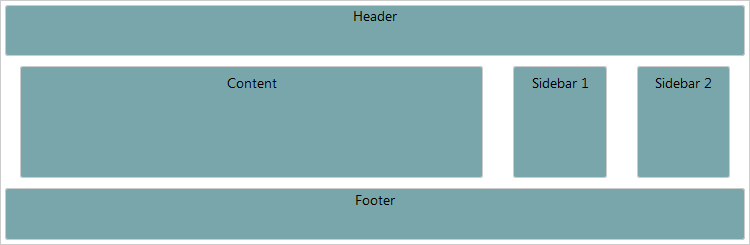

# Responsive Layout


The following article demonstrates the basics of creating a **Responsive Layout**.

## Responsive Layout

The concept behind **responsive layout** is to adapt your application to the capabilities of the client (the end user) device (browser). This is usually done with two very simple transformations: resizing the content placeholders or hiding them. For example, showing the entire content of your web-site may not be quite user-friendly, in cases when it is browsed via mobile device. In that case you may need to hide portions of the content.

With the **RadPageLayout** control, you could easily do so, by using the responsive attributes: **HiddenXl, HiddenLg, HiddenMd, HiddenSm, and HiddenXs**. These manage the visibility of respective content place holders when viewed under various devices. In other cases you may need to resize a certain container. Again, that's easy to do with **RadPageLayout** and responsive attributes: **SpanXs, SpanSm, SpanMd, SpanLg or SpanXl**. Those attributes, as the name suggests, control the Span of the columns under the various breakpoints. In other words once you have created your initial design, adding responsive capabilities is just a matter of configuration and setting a couple of properties.

>tip In order to use the **RadPageLayout** responsive capabilities on a mobile device you have to add the following metatag to the head section of the page:


````ASPNET
<head id="Head1" runat="server">
    <meta name="viewport" content="width=device-width, initial-scale=1" />
</head>
````

## Example

The example below, demonstrates how you could hide the sidebars, when the resolution is small (sm) or extra small (xs). In addition, you could observe how the **Spans** of the columns are changed, when the viewport size is less then 768px (using SpanXs and SpanSm).You can find more information about viewport breakpoints in the [this]() article.

````ASPNET
<head id="Head1" runat="server">
	<meta name="viewport" content="width=device-width, initial-scale=1" />
    <title></title>
    <style type="text/css">
        body {
            margin: 0;
            padding: 0;
            padding-top: 20px;
            font: 14px/normal "Segoe UI", sans-serif;
        }

        .col, .header, .footer {
            background-color: #78a6ab;
            border: 1px solid #cccccc;
            text-align: center;
            border-radius: 3px;
        }

        .header, .footer {
            height: 50px;
        }

        .col {
            margin: 10px 0;
            padding: 5px 10px;
            height: 100px;
        }
    </style>

</head>
<body>
    <form id="form1" runat="server">
        <telerik:radscriptmanager id="Radscriptmanager1" runat="server"></telerik:radscriptmanager>

        <telerik:radpagelayout id="RadPageLayout1" runat="server" gridtype="Fluid">
            <Rows>
                <telerik:LayoutRow>
                    <Content>
                        <div class="header">Header</div>
                    </Content>
                </telerik:LayoutRow>
                <telerik:LayoutRow>
                    <Columns>

                        <telerik:LayoutColumn Span="8" SpanXs="12" SpanSm="12">
                            <div class="col">
                                Content
                            </div>
                        </telerik:LayoutColumn>
                        <telerik:LayoutColumn Span="2" HiddenXs="true" HiddenSm="true">
                            <div class="col">
                                Sidebar 1
                            </div>
                        </telerik:LayoutColumn>
                        <telerik:LayoutColumn Span="2" HiddenXs="true" HiddenSm="true">
                            <div class="col">
                                Sidebar 2
                            </div>
                        </telerik:LayoutColumn>
                    </Columns>
                </telerik:LayoutRow>

                <telerik:LayoutRow>
                    <Content>
                        <div class="footer">Footer</div>
                    </Content>
                </telerik:LayoutRow>
            </Rows>
		</telerik:radpagelayout>
````


The Figures bellow, demonstrates the different layout, regarding the different resolutions. 
>caption Figure 1: Result from the Example, when the viewport size is greater than 768px.


>caption Figure 2: Result from the Example, when the viewport size is less than 768px.


# See Also

 * [Overview]()
