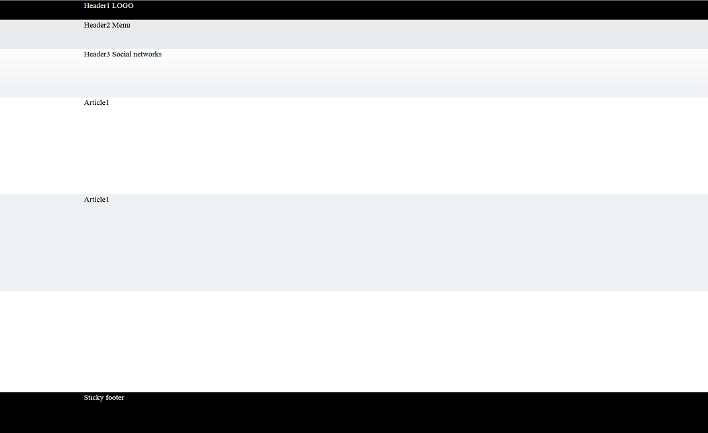

# How to Make Sticky Footer and Header


This article demonstrates how to create a scenario with sticky footer and header.

## Sticky footer and header

In the example bellow you will see how to make the footer to be always positioned at the bottom of the page even if the content does not fill the entire gap between the header and the footer. Assuming the fact that in real scenario the header and footer are placed in master page this example shows how to use two nested RadPageLayouts to accomplish that. The inner one can go to your content page to define the content structure. The outer RadPageLayout will take care of positioning the header sections and the footer. In order to have the rows content to be centered they should have **RowType** property set to **"Container"**.

>note The "sticky" effect is accomplished by css and it does comes out of the box when using the RadPageLayout. In this scenario the RadPageLayout gives you the ability to structure your main elements and the content.
>

>caption Figure 1: Result of nesting RadpageLayout and applying styles in order to accomplish sticky footer and header.



**Example Code**

````ASPNET
<style type="text/css">
    .header1 {
        background-color: black;
        position:fixed;
        width:100%;
        top:0;
        z-index:1000;
    }

    .header2 {
        background-color: #E8EAEC;
    }

    .header3 {
        background: linear-gradient(#FDFEFE, #F0F2F4) repeat scroll 0 0 rgba(0, 0, 0, 0);
    }


    .content {
    }

    .article2 {
        background-color: #EEF1F3;
    }

    .footer {
        background-color: black;
    }

    html,
    body,
    form {
        margin: 0;
        padding: 0;
        height: 100%;
    }

    .container {
        min-height: 100%;
        position: relative;
    }


    .allContent {
        padding-top:40px;
        padding-bottom: 84px; /* Height of the footer */
    }

    .footer {
        position: absolute;
        bottom: 0;
        width: 100%;
        height: 84px; /* Height of the footer */
        background: black;
    }
</style>
````


````ASPNET
<telerik:RadPageLayout runat="server" ID="PageLayoutMaster" HtmlTag="None" GridType="Fluid" >
    <Rows>
        <telerik:LayoutRow RowType="Generic" CssClass="container">
            <Rows>
                <telerik:LayoutRow RowType="Generic" CssClass="allContent">
                    <Rows>
                        <telerik:LayoutRow RowType="Container" WrapperCssClass="header1" WrapperHtmlTag="Div">
                            <Content>
                                <div style="height: 40px"><a style="color: white">Header1 LOGO</a></div>
                            </Content>
                        </telerik:LayoutRow>
                        <telerik:LayoutRow RowType="Container" WrapperCssClass="header2" WrapperHtmlTag="Div">
                            <Content>
                                <div style="height: 60px"><a style="color: black">Header2 Menu</a></div>
                            </Content>
                        </telerik:LayoutRow>
                        <telerik:LayoutRow RowType="Container" WrapperCssClass="header3" WrapperHtmlTag="Div">
                            <Content>
                                <div style="height: 100px"><a style="color: black">Header3 Social networks</a></div>
                            </Content>
                        </telerik:LayoutRow>
                        <telerik:LayoutRow RowType="Container" WrapperCssClass="content" WrapperHtmlTag="Div" HtmlTag="None">
                            <Content>
                                <telerik:RadPageLayout runat="server" ID="PageLayoutConent" HtmlTag="None" GridType="Fluid">
                                    <Rows>
                                        <telerik:LayoutRow RowType="Container" WrapperCssClass="article1" WrapperHtmlTag="Div">
                                            <Content>
                                                <div style="height: 200px">Article1 </div>
                                            </Content>
                                        </telerik:LayoutRow>
                                        <telerik:LayoutRow RowType="Container" WrapperCssClass="article2" WrapperHtmlTag="Div">
                                            <Content>
                                                <div style="height: 200px">Article1 </div>
                                            </Content>
                                        </telerik:LayoutRow>
                                    </Rows>
                                </telerik:RadPageLayout>
                            </Content>
                        </telerik:LayoutRow>
                    </Rows>
                </telerik:LayoutRow>

                <telerik:LayoutRow RowType="Container" WrapperCssClass="footer" WrapperHtmlTag="Div">
                    <Content>
                        <div style="height: 84px"><a style="color: white">Sticky footer</a></div>
                    </Content>
                </telerik:LayoutRow>
            </Rows>
        </telerik:LayoutRow>

    </Rows>
</telerik:RadPageLayout>
````


