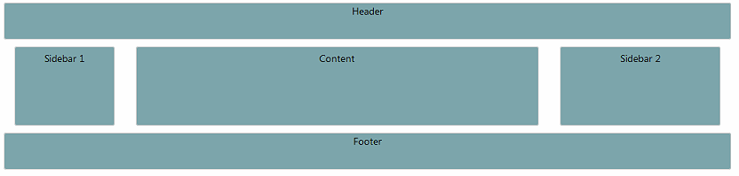
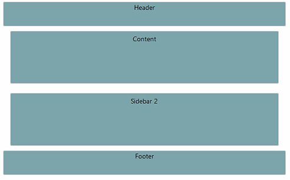

# React to Viewport Change


This article will show you how to use the **RadPageLayout** control and its viewport breakpoints to create a responsive	layout that changes according to the browser viewport size.

The breakpoints represents the predefined viewport sizes at which a **LayoutColumn** could be set to be hidden	(e.g. **HiddenSm** attribute) or to fit into different **Span** size (e.g. **SpanSm** attribute).

More about the breakpoints and the available attributes is explained in the [Viewport Breakpoints]() article.

## Creating a Page that Reacts to the Viewport Size

**Example 1** shows how to hide the first **LayoutColumn** and change the **Span** size of the second and third one when the viewport	size appear to be less than 768px. The results of this example can be examined in **Figure 1** and **Figure 2**.
>caption Figure 1: Result from the markup in Example 1 when the viewport size is greater than 768px.


>caption Figure 2: Result from the markup in Example 1 when the viewport size is less than 768px.



**Example 1**: Using Breakpoints to create a responsive layout.

````ASPNET
<!DOCTYPE html>
<html xmlns="http://www.w3.org/1999/xhtml">
<head id="Head1" runat="server">
	<title></title>
	<meta name="viewport" content="width=device-width, initial-scale=1.0" />
	<style type="text/css">
		body {
			margin: 0;
			padding: 0;
			padding-top: 20px;
			font: 14px/normal "Segoe UI", sans-serif;
		}
	
		.col, .header, .footer {
			background-color: #78a6ab;
			border: 1px solid #cccccc;
			text-align: center;
			border-radius: 3px;
		}

		.header, .footer {
			height: 50px;
		}

		.col {
			margin: 10px 0;
			padding: 5px 10px;
			height: 100px;
		}
	</style>
</head>
<body>
	<form id="form1" runat="server">
		<telerik:RadScriptManager ID="ScriptManager" runat="server">
		</telerik:RadScriptManager>
		
		<telerik:RadPageLayout runat="server" GridType="Fluid">
			<Rows>
				<telerik:LayoutRow>
					<Content>
						<div class="header">Header</div>
					</Content>
				</telerik:LayoutRow>
				<telerik:LayoutRow>
					<Columns>
						<telerik:LayoutColumn Span="2" HiddenXs="true" HiddenSm="true">
							<div class="col">Sidebar 1</div>
						</telerik:LayoutColumn>
						<telerik:LayoutColumn Span="7" SpanXs="12" SpanSm="12">
							<div class="col">
								Content
							</div>
						</telerik:LayoutColumn>
						<telerik:LayoutColumn Span="3" SpanXs="12" SpanSm="12">
							<div class="col">
								Sidebar 2
							</div>
						</telerik:LayoutColumn>
					</Columns>
				</telerik:LayoutRow>
				<telerik:LayoutRow>
					<Content>
						<div class="footer">Footer</div>
					</Content>
				</telerik:LayoutRow>
			</Rows>
		</telerik:RadPageLayout>
	</form>
</body>
</html> 
````


# See Also

 * [Viewport Breakpoints]()
