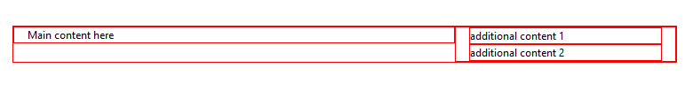

# PageLayout Overview


The **RadPageLayout** control is a really simple and light-weight control for creating layouts. With the proper configuration it becomes a powerful layout tool that addresses both desktop and mobile device design. It is specially designed to help you adapt your page look good regardless of the device that you use – this includes extra large, large, medium, small or extra small devices.

## Elements

Modeled after a [grid ]() system, the **RadPageLayout** control has only two elements - rows and columns. Using those you can create grid-like wireframes that can then fill with content.

* [Rows]() - The rows are simple containers for columns. They also have an additional placeholder element (<Content>) for own content. A row has no own specific properties, only the standard ones.

* [Columns]() - The column is the structural unit of design. If you are not familiar with grid systems, you can view them as a sort of table cell (but not quite).

>note The span attribute sets the size (or width) of a columns, measured grid units. The grid unit itself is an abstract unit and represents fraction of the total container width. In the case of this control, one grid unit equals 1/12 of the total width. **Therefore the sum of the values for all spans in a single row can be up to 12 units** .
>
In addition to the standard properties, a column has few specific properties that are covered in the [Columns ]() help article.

## Properties

**RadPageLayout** control provides two sets of properties:

* **Global**properties that can be applied to the control container, rows and columns.

* **Specific**properties that are applied only on the control container or columns.

Global properties are **HtmlTag**, visibility properties (see [Responsive Layout]() topic for more details), **StaticId**, as well as inherited properties such as **CssClass**, **ID** etc. We use properties to extend the rendering of the control. For instance, the **HtmlTag** property, as the name suggests, changes the HTML element that is going to be rendered for that server-side control. The **StaticId** property specifies the actual rendered Id attribute and so on.

## Putting it All Together

To jumpstart building layouts, you need only one attribute - the span attribute. It specify how wide a column is in terms of grid units. (See [Grid Based Layout ]() help topic for more details on grids and grid based layouts).

````ASPNET
	<head runat="server">
	    <title></title>    
	    <style type="text/css">
	        .borderCssClass div {
	            border: 1px solid red;
	        }
	    </style>
	  </head>
````


````ASPNET
	  <telerik:RadPageLayout ID="RadPageLayout1" runat="server" GridType="Fluid" CssClass="borderCssClass">
	            <Rows>
	                <telerik:LayoutRow >
	                             <Columns>
	                        <telerik:LayoutColumn Span="8">
	                            Main content here
	                        </telerik:LayoutColumn>
	                        <telerik:CompositeLayoutColumn Span="4">
	                            <Rows>
	                                <telerik:LayoutRow>
	                                    <Content>additional content 1</Content>
	                                </telerik:LayoutRow>
	                                <telerik:LayoutRow>
	                                    <Content> additional content 2</Content>
	                                </telerik:LayoutRow>
	                            </Rows>
	
	                        </telerik:CompositeLayoutColumn>
	                    </Columns>
	                </telerik:LayoutRow>
	           </Rows>
	        </telerik:RadPageLayout>
	
````


>caption Figure 1. RadPageLayout control



That is all you need to create a very simple layout.

# See Also

 * [Container]()

 * [Rows]()

 * [Columns]()
