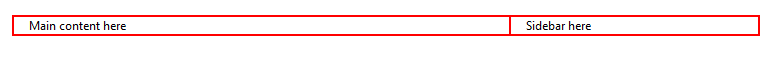

# Columns 


This article provides information about columns that you can use in the **RadPageLayout** control. Once you set the needed rows in the **RadPageLayout** you can further extend its content to hold the need controls in either LayoutColumn or CompositeLayoutColumn. In this article you can also find out what attributes can be applied and how to declare them on your page.

## Columns in RadPageLayout

A column or also declared as a LayoutColumn element in the markup code of the **RadPageLayout** control is the structural unit of design. If you are not familiar with grid systems, you can view them as a sort of table cell (but not quite). The LayoutColumn has span attribute that sets the size (or width) of a column (measured in grid units).

>note The grid unit itself is an abstract unit and represents fraction of the total container width. In the case of this control, one grid unit equals 1/12 of the total width.
>


In addition to the standard attributes, a column has few specific attributes that are listed below:


| Property Name | Description |
| ------ | ------ |
| **Span** |Gets or sets the span (size or width) of the column in grid units. Default value is 12.|
| **HtmlTag** |Gets or sets the HTML tag that will be rendered for this element. If the property is not set, it will return DIV element; if the property is set to None, only the element's content will be rendered.|
| **StaticID** |Gets or sets the actual rendered ID attribute. If the property is not set, it will return an empty string.|
| **Pull** |Moves the column element to the left side. An important note here is that this is only visually and it is accomplished by setting **position: "absolute"** to the column element and sets the position coordinates. It does not affect any other element on the page. Such behavior could be applied for a specific screen size only by using one of the following properties: **PullXs** , **PullSm** , **PullMd** , **PullLg** or **PullXl** .|
| **Push** |Moves the column element to the right side. As **Pull** property this is only visually and does not affect any other element on the page. Such behavior could be applied for a specific screen size only by using one of the following properties: **PushXs** , **PushSm** , **PushMd** , **PushLg** or **PushXl** .|
| **Offset** |Moves the column element to the left or right side. The main difference is that it applies margin value to the row element and eventually this affects the layout. Such behavior could be applied for a specific screen size only by using one of the following properties: **OffsetXs** , **OffsetSm** , **OffsetMd** , **OffsetLg** or **OffsetXl** .|

````ASPNET
<head runat="server">
    <title></title>    
    <style type="text/css">
        .borderCssClass div {
            border: 1px solid red;
        }
    </style>
</head>
````


````ASPNET
	           
<telerik:RadPageLayout ID="RadPageLayout1" runat="server">
    <Rows>
        <telerik:LayoutRow>
            <Columns>
                <telerik:LayoutColumn Span="8">
                    Main content here
                </telerik:LayoutColumn>
                <telerik:LayoutColumn Span="4">
                    Sidebar here
                </telerik:LayoutColumn>
            </Columns>
        </telerik:LayoutRow>
    </Rows>
</telerik:RadPageLayout>
````


>caption Figure 1. RadPageLayout control



## Composite Columns in RadPageLayout

>note Composite columns have the same attributes as "simple" columns.
>


A **CompositeLayoutColumn** is a structural unit of design that can hold different elements that need to be positioned in a specific way on the page. In the code below you can get a better idea how to use it.

````ASPNET
<head runat="server">
    <title></title>    
    <style type="text/css">
        .borderCssClass div {
            border: 1px solid red;
        }
    </style>
</head>
````


````ASPNET
<telerik:RadPageLayout ID="RadPageLayout1" runat="server" GridType="Fluid" CssClass="borderCssClass">
    <Rows>
        <telerik:LayoutRow >
                     <Columns>
                <telerik:LayoutColumn Span="8">
                    Main content here
                </telerik:LayoutColumn>
                <telerik:CompositeLayoutColumn Span="4">
                    <Rows>
                        <telerik:LayoutRow>
                            <Content>additional content 1</Content>
                        </telerik:LayoutRow>
                        <telerik:LayoutRow>
                            <Content> additional content 2</Content>
                        </telerik:LayoutRow>
                    </Rows>

                </telerik:CompositeLayoutColumn>
            </Columns>
        </telerik:LayoutRow>
   </Rows>
</telerik:RadPageLayout>
````


>caption Figure 2. RadPageLayout control


# See Also

 * [Overview]()
