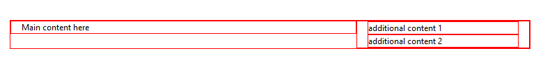

# Columns 


This article provides information about columns that you can use in the **RadPageLayout** control. Once you set the needed rows in the **RadPageLayout** you can further extend its content to hold the need controls in either LayoutColumn or CompositeLayoutColumn. In this article you can also find out what attributes can be applied and how to declare them on your page.

## Columns in RadPageLayout

A column or also declared as a LayoutColumn element in the markup code of the **RadPageLayout** control is the structural unit of design. If you are not familiar with grid systems, you can view them as a sort of table cell (but not quite). The LayoutColumn has span attribute that sets the size (or width) of a column (measured in grid units).

>note The grid unit itself is an abstract unit and represents fraction of the total container width. In the case of this control, one grid unit equals 1/12 of the total width.
>


In addition to the standard attributes, a column has few specific attributes that are listed below:


| Property Name | Description | Type | Default value |
| ------ | ------ | ------ | ------ |
| **Span** |Gets or sets the span (size or width) of the column.| Grid units / number | 12 |
| **Pull** |Moves the column element to the left **without affecting** other content. Could be applied globally, or per screen size, using one of the following properties: **PullXs** , **PullSm** , **PullMd** , **PullLg** or **PullXl** .| Grid units / number | 0 |
| **Push** |Moves the column element to the right **without affecting** other content. Could be applied globally, or per screen size, using one of the following properties: **PushXs** , **PushSm** , **PushMd** , **PushLg** or **PushXl** .| Grid units / number | 0 |
| **Offset** |Moves the column element to the left or right and **affects** other content. Could be applied globally, or per screen size, using one of the following properties: **OffsetXs** , **OffsetSm** , **OffsetMd** , **OffsetLg** or **OffsetXl** .| Grid units / number | 0 |
| **HtmlTag** |Gets or sets the HTML tag that will be rendered for this element. If the property is not set, it will return DIV element; if the property is set to None, only the element's content will be rendered.| tag | &lt;div&gt; |
| **StaticID** |Gets or sets the actual rendered ID attribute. If the property is not set, it will return an empty string.| ID / string | none |


>note **Pull** and **Push** properties are implemented using **position: absolute** CSS rule and position **coordinates**. In consequence, the change in the position of a column using those two properties will not affect the other content (columns). At the same time, **Offset** property applies the customizations on the **margin** CSS property of the column. Therefore, using **Offset** will affect (move) other content (columns).
>


````CSS
.borderCssClass div {
	border: 1px solid red;
}
````

````ASPNET
<telerik:RadPageLayout ID="RadPageLayout1" runat="server">
    <Rows>
        <telerik:LayoutRow>
            <Columns>
                <telerik:LayoutColumn Span="8">
                    Main content here
                </telerik:LayoutColumn>
                <telerik:LayoutColumn Span="4">
                    Sidebar here
                </telerik:LayoutColumn>
            </Columns>
        </telerik:LayoutRow>
    </Rows>
</telerik:RadPageLayout>
````


>caption Figure 1. RadPageLayout control


## Composite Columns in RadPageLayout

>note Composite columns have the same attributes as "simple" columns.
>


A **CompositeLayoutColumn** is a structural unit of design that can hold different elements that need to be positioned in a specific way on the page. In the code below you can get a better idea how to use it.

````CSS
.borderCssClass div {
	border: 1px solid red;
}
````

````ASPNET
<telerik:RadPageLayout ID="RadPageLayout1" runat="server" GridType="Fluid" CssClass="borderCssClass">
    <Rows>
        <telerik:LayoutRow >
                     <Columns>
                <telerik:LayoutColumn Span="8">
                    Main content here
                </telerik:LayoutColumn>
                <telerik:CompositeLayoutColumn Span="4">
                    <Rows>
                        <telerik:LayoutRow>
                            <Content>additional content 1</Content>
                        </telerik:LayoutRow>
                        <telerik:LayoutRow>
                            <Content> additional content 2</Content>
                        </telerik:LayoutRow>
                    </Rows>

                </telerik:CompositeLayoutColumn>
            </Columns>
        </telerik:LayoutRow>
   </Rows>
</telerik:RadPageLayout>
````


>caption Figure 2. RadPageLayout control



# See Also

 * [Overview]()
