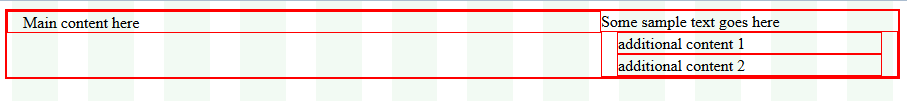

# Rows


This article provides information about the rows that you can use in the __RadPageLayout__ control. You can also find out what attributes that can be applied and how to declare them on your page.

## Rows

Since __Q2 2014__ rows could be nested using the property __Rows__. Rows are simple containers for holding columns. They can either hold LayoutRow element or Content elements. Below you can find few examples demonstrating the purpose of the Content elements and LayoutRow element as well as the attributes that can be set:


| Property Name | Description |
| ------ | ------ |
| __HtmlTag__ |Gets or sets the HTML tag that will be rendered for this element. If the property is set to None, only the element's content will be rendered.|
| __StaticId__ |Gets or sets the actual rendered ID attribute. If the property is not set, it will return an empty string.|
| __WrapperHtmlTag__ |Gets or sets the HTML tag that will be rendered for the wrapper of this element. If the property is set to None, the wrapper will not be rendered.|
| __WrapperCssClass__ |Gets or sets the wrapper HTML class.|
| __Hidden[Device Resolution]__ |Boolean value to show (when set to __false__ ) or hide (when set to __true__ ) the corresponding row depending on the device resolution - Xl, Lg, Md, Sm, Xs (for instance this can be __HiddenXl="true"__ ).|
| __Rows__ |Contains the nested rows.|
| __RowType__ |Determine what styles will be applied for the row element. The available values are:

*  __Container__ - applies the styles from the RadPagePayout div container to the row element.

*  __Row__ - the default value.

*  __Generic__ - no styles are applied to the row element.

*  __Region__ - region styles are applied.|

Since rows in the __RadPageLayout__ control are designed in a very flexible way you can use them in two ways:

* You can directly place the desired content in the defined row only by using the __<Content> ...</Content>__. This can be any HTML or control that you need to place at the desired position.

* You can create additional columns by using the __<Columns> ... </Columns>__

Below you can find a sample code that demonstrates how you can use either of the approaches:

````ASPNET
	<head runat="server">
	    <title></title>    
	    <style type="text/css">
	        .borderCssClass div {
	            border: 1px solid red;
	        }
	    </style>
	  </head>
````


````ASPNET
	            
	          <telerik:RadPageLayout ID="RadPageLayout2" runat="server" CssClass="borderCssClass"
	             ShowGrid="true" GridType="Fluid" >
	          <Rows>
	              <telerik:LayoutRow  HtmlTag="Div" WrapperHtmlTag="Div" >
	                  <Content>
	                     Some sample text goes here
	                  </Content>
	                    <Columns>
	                      <telerik:LayoutColumn Span="8">
	                          Main content here
	                      </telerik:LayoutColumn>
	                      <telerik:CompositeLayoutColumn Span="4">
	                          <Rows>
	                              <telerik:LayoutRow WrapperHtmlTag="Div">                                  
	                                  <Content>additional content 1</Content>
	                              </telerik:LayoutRow>
	                              <telerik:LayoutRow WrapperHtmlTag="Div">
	                                  <Content> additional content 2</Content>
	                              </telerik:LayoutRow>
	                          </Rows>
	                      </telerik:CompositeLayoutColumn>
	                  </Columns>
	              </telerik:LayoutRow>
	         </Rows>
	      </telerik:RadPageLayout>
````


>caption Figure 1. RadPageLayout control demonstrating how to use rows and columns



# See Also

 * [Overview]()
