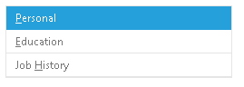

# Keyboard Support


A critical requirement for software accessibility is keyboard support as a complete alternative to pointing devices (mouse, etc.). Keyboard support is comprised of access keys, keyboard navigation, and keyboard shortcuts. **RadPanelBar** seamlessly switches between mouse and keyboard navigation, just like in desktop applications.

Using the **AccessKey** property, you can associate an activation combination (access key) which moves focus to a particular panel item and enables keyboard navigation. When there are multiple panel bars on a given page, each of them may have a different activation combination.

## Setting access keys

**AccessKey** is a property of the **RadPanelItem** class. **AccessKey** sets the keyboard shortcut that can be used to move focus to a panel item. The value of the **AccessKey** property can only be a single character. When the user presses the [ALT] key in combination with the value specified by **AccessKey**, focus moves to the associated item. The user can then subsequently use the arrow keys for navigation. (See below.)

>note In Opera, access keys work by pressing Shift+ESC, then pressing the assigned access key.
>


To set a keyboard shortcut to a menu item, simply set the **AccessKey** property to the desired key. When **AccessKey** is set, the character specified by **AccessKey** appears underlined in the panel item text:



````ASPNET
	    <telerik:radpanelbar id="RadPanelBar1" runat="server" skin="Metro">  
	    <Items>    
	        <telerik:RadPanelItem  runat="server" Text="Personal" AccessKey="P" />    
	        <telerik:RadPanelItem  runat="server" Text="Education" AccessKey="E" />    
	        <telerik:RadPanelItem  runat="server" Text="Job History" AccessKey="H" />  
	    </Items>
	    </telerik:radpanelbar>
````


## Keyboard navigation

Keyboard navigation is supported by using the [TAB] and arrow keys. Use the [TAB] key to move focus to the first panel item, and then use the up and down arrow keys to move among panel items.

An alternative to arrow keys for moving forward and backward along the panel bar are the [TAB] and [SHIFT]+[TAB] key combinations:

* To move forward, use the [TAB] key.

* To move backward, use the [SHIFT]+[TAB] key combination.

Child panel items are expanded using the [ENTER] key when the parent panel item has focus. Once a panel is expanded, the child items enter the tab sequence, so that the arrow key or [TAB] key navigation now includes all visible panel items, regardless of their level.

If a panel item has no child items, then pressing the [ENTER] key when the item has focus causes the item to be selected.

To collapse a group of child panel items, use the [ESC] when the parent item has focus.

>note Collapsing items using the [ESC] key does not always work. It depends on the[ExpandMode property]().
>


# See Also

 * [RadPanelBar Item Builder]()
