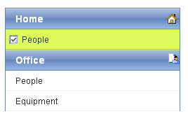

# Adding Images to Items


## 

Each **RadPanelItem** has a set of properties you can use to add images to your panel items. You can simply add a single image to each panel item, or you can add separate images that reflect the state of the panel item.

The following properties let you add images to panel items:

* **ImageUrl** specifies an image that is added to the panel item. This image is always used, unless you set one of the other properties to specify an alternate image to use in a specific state.

* **HoveredImageUrl** specifies an image that is used when the mouse is over the panel item.

* **SelectedImageUrl** specifies an image that is used when the panel item is selected.

* **ExpandedImageUrl** specifies an image that is used when the panel item is expanded, showing its child items.

* **DisabledImageUrl** specifies an image that is used when the item is disabled.

To set the image properties at design time, use the [RadPanelBar Item Builder]().

The **ImagePosition** property specifies where the image appears in the panel item. When **ImagePosition** is "Left" (the default value), the image appears to the left of the item text. When **ImagePosition** is "Right", the image appears on the far right of the item.

>caution Some skins (such as the "Web20" skin) use the position on the right to display an expand or collapse arrow. By setting **ImagePosition** to "Right", you can hide the arrow that the skin provides.
>


The following example uses the **ImageUrl** and **SelectedImageUrl** properties to create a **RadPanelBar** that includes images on its items. The **ImagePosition** is set to "Right" for parent items and "Left" for child items:



````ASPNET
<telerik:RadPanelBar
   ID="RadPanelBar1"
   runat="server"
   Skin="Web20">
 <Items>
    <telerik:RadPanelItem
        runat="server"
        Text="Home"
        ImageUrl="~/Images/home.gif"
        SelectedImageUrl="~/Images/SelectedHome.gif"
        ImagePosition="Right">
      <Items>
        <telerik:RadPanelItem
           runat="server"
          Text="People"
          SelectedImageUrl="~/Images/Selected.gif"
          ImageUrl="~/Images/blank.gif">
        </telerik:RadPanelItem>
      </Items>
    </telerik:RadPanelItem>
    <telerik:RadPanelItem
        runat="server"
        Text="Office"
        ImageUrl="~/Images/office.gif"
        SelectedImageUrl="~/Images/SelectedOffice.gif"
        ImagePosition="Right">
      <Items>
        <telerik:RadPanelItem
          runat="server"
          Text="People"
          SelectedImageUrl="~/Images/Selected.gif"
          ImageUrl="~/Images/blank.gif">
        </telerik:RadPanelItem>
        <telerik:RadPanelItem
          runat="server"
          SelectedImageUrl="~/Images/Selected.gif"
          Text="Equipment"
          ImageUrl="~/images/blank.gif">
        </telerik:RadPanelItem>
      </Items>
    </telerik:RadPanelItem>
 </Items>
</telerik:RadPanelBar> 
````


# See Also

 * [Controlling Appearance]()

 * [Skins]()

 * [Overview]()

 * [Setting  the CSS Class of Items]()
