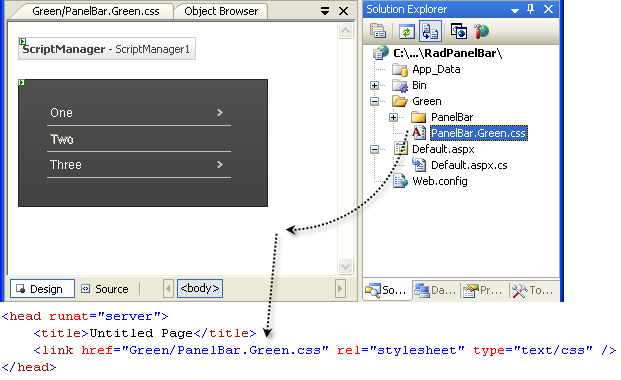

# Creating A Custom Skin


 
The following tutorial demonstrates creating a custom **RadPanelBar** skin, using the default skin as a base. This new skin will take the appearance of the panel bar from its default look:


to the following:


>note See [Understanding the Skin CSS File](https://www.telerik.com/help/aspnet-ajax/panelbar-appearance-css-file.html) for more information on specific CSS file properties.
>

## Prepare the Project

* Drag a **RadPanelBar** from the toolbox onto a new AJAX-enabled application Web form.

* Use the **RadPanelBar Item Builder** to add items to the panel bar, or add them in the HTML markup. Include two levels of items nested in the root items:

````ASPNET

<telerik:RadPanelBar RenderMode="Lightweight" 
    id="RadPanelBar1" 
    runat="server">  
    <Items>    
        <telerik:RadPanelItem runat="server" Text="One" >      
        <Items>        
            <telerik:RadPanelItem runat="server" Text="i" >          
            <Items>            
                <telerik:RadPanelItem runat="server" Text="a" />            
                <telerik:RadPanelItem runat="server" Text="b" />          
            </Items>        
            </telerik:RadPanelItem>        
            <telerik:RadPanelItem runat="server" Text="ii" />        
            <telerik:RadPanelItem runat="server" Text="iii" />      
          </Items>    
          <telerik:RadPanelItem>    
          <telerik:RadPanelItem runat="server" Text="Two" />    
          <telerik:RadPanelItem runat="server" Text="Three" >      
          <Items>        
            <telerik:RadPanelItem runat="server" Text="i" />      
          </Items>    
        </telerik:RadPanelItem>  
    </Items>
</telerik:RadPanelBar>

````

* In the Solution Explorer, create a new "Green" directory in your project.

* Copy the default **RadPanelBar** skin files from the installation directory to the "Green" directory; copy both the \PanelBar directory that contains the images for this skin and the PanelBar.Default.css file that defines the skin styles.

>note The file path will typically be similar to this example: `\Program Files\Progress\UI for ASP.NET AJAX RX YYYY\Skins\Default.`
>
    
* In the Solution Explorer, rename "PanelBar.Default.css" to "PanelBar.Green.css". The Solution Explorer should now look something like the following:


* Open PanelBar.Green.css and replace all instances of _Default with _Green. Then save the file:


* Drag the "PanelBar.Green.Css" file from the Solution Explorer onto your Web page. This automatically adds a reference to the page "`<head>`" tag as a "`<link>`" to the new stylesheet:



* Set the **EnableEmbeddedSkins** property of the **RadPanelBar** control to **False**.

* Change the **Skin** property of your **RadPanelBar** control to "Green".

* Run the application. The new "Green" skin looks just like the Default skin:


## Modifying the CSS file

* The first selector in the CSS file sets the background attribute for the panel bar. Change this from an image to a simple green color ("#aad19f"):

````CSS
.RadPanelBar_Green{ background: #aad19f;}
````
    
* The next selector in the CSS file **(.RadPanelBar_Green ul.rpRootGroup)** affects the appearance of the root items in the panel bar. This class is applied to a UL element that lays out the panel items. Change the border color to "green" and remove the padding:

````CSS
.RadPanelBar_Green ul.rpRootGroup{ border: 1px solid green;}
````

* The next selector **(.RadPanelBar_Green_rtl ul.rpRootGroup)** serves much the same purpose, but for panel bars with a right-to-left orientation. Remove the padding from this rule as well:

````CSS
.RadPanelBar_Green_rtl ul.rpRootGroup{ text-align: right;}
````

* The next selector **(.RadPanelBar_Green .rpLink)** is applied to every panel item in the panel bar. Change the border color to "Green":

````CSS
.RadPanelBar_Green .rpLink
{ 
    border-bottom: 1px solid green; 
    overflow-x: hidden;
}
````

* The next selector **(.RadPanelBar_Green .rpLink:hover)** uses the **hover** pseudo-class to change the bottom border when the mouse hovers over an item. Instead of changing the border, we will change the background color slightly, so replace this rule with the following:

````CSS
.RadPanelBar_Green .rpLink:hover{ background: #afd8a4;}
````

* The next few selectors involve the .rpText class, which is applied to the text label of items. When an item has child items, the A element in its rendering gets the **.rpExpandable** or **.rpExpanded** class applied in addition to the **.rpLink** class. A number of selectors in the CSS file use this class to handle the arrows that appear on these items. Leave these rules as-is, making use of the arrows from the default skin.

* Child items in the panel bar are laid out using a UL element with the **.rpGroup** class applied. Locate the selector for this class **(.RadPanelBar_Green .rpGroup).** Add a new background color to distinguish these items from the root items:

````CSS
.RadPanelBar_Green .rpGroup
{ 
    overflow-x: hidden; 
    overflow-y: auto; 
    background: #edffe0;
}
````

* Following the rule for **.rpGroup** are a series of selectors for adjusting the borders of child items. (Some of these use the **.rpGroup** class, and some use the **.rpLevel1** class, which applies only to level 1 items). As the "Green" skin is using background color rather than borders to distinguish levels, delete these rules:

````CSS
.RadPanelBar_Green .rpGroup .rpLink,.RadPanelBar_Green .rpGroup .rpLast .rpLink
{
    border-bottom-color: #626262;
}
.RadPanelBar_Green .rpLevel1 .rpLink .rpFirst
{ 
    border-top: 1px solid #bfbfbf;
}
.RadPanelBar_Green .rpLevel1 .rpLink .rpItem .rpFirst
{ 
    border-top: 1px solid #626262;
}
.RadPanelBar_Green .rpLast .rpLink
{ 
    border-bottom: 0;
}
````

* In place of the deleted rules, add a selector for child items that uses the **hover** pseudo-class to change the background color on child items when the mouse is over them:

````CSS
.RadPanelBar_Green .rpGroup .rpLink:hover{ background: #f0ffd5;}
````

* Locate the **.RadPanelBar_Green .rpRootGroup .rpText** selector. This is applied to the text labels on root items. Change the font color from white ("#fff") to "Green":

````CSS
.RadPanelBar_Green .rpRootGroup .rpText
{ 
    font: normal 12px Arial, Verdana, Sans-serif;
    color: green; 
    padding: 5px 7px 5px 3px;
}	
````

* Locate the selector for the text of selected items **(.RadPanelBar_Green .rpSelected .rpText).** This sets the font weight of selected items to "bold". Add an additional rule to increase the font size to "larger":

````CSS
.RadPanelBar_Green .rpSelected .rpText
{ 
    font-weight: bold; 
    font-size: larger;
}
````

* Because child items already appear smaller than the root level items, the rule added in the last step is a bit too dramatic for these items. Add a new selector (using the **.rpGroup** class) to set the font size on selected child items:

````CSS
.RadPanelBar_Green .rpGroup .rpSelected .rpText
{ 
    font-weight: bold; 
    font-size: medium;
}
````

* The last two selectors in the CSS file are used to set the properties of disabled items. Remove the change to the borders of disabled items:

````CSS
.RadPanelBar_Green .rpRootGroup .rpDisabled:hover
{ 
   cursor: default; 
   text-decoration:none;
} 
.RadPanelBar_Green .rpGroup .rpDisabled:hover
{ 
   cursor: default; text-decoration:none;
}
````

* Run the application. The panel bar should now look as follows:


For more information about Cascading Style Sheets, see

[World Wide Web Consortium CSS specifications](https://www.w3.org/Style/CSS/)

[W3 Schools CSS tutorial](https://www.w3schools.com/css/default.asp)

[Guide to Cascading Style Sheets](http://www.htmlhelp.com/reference/css/)

## See Also

[Skins]()
[Setting the CSS Class of Items]()

