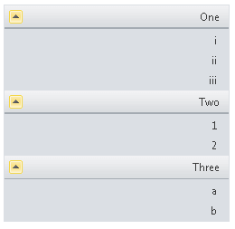

# RTL support


## 

**RadPanelBar** includes support for right-to-left locales using the direction attribute. If you set **dir="rtl"** on the **RadPanelBar** object or on any parent HTML element, **RadPanelBar** changes the position of the text that appears on items:



>note Image position is still controlled by the **ImagePosition** property.
>


````ASPNET
	     
<telerik:RadPanelBar
   ID="RadPanelBar1" runat="server"
   Skin="Office2010Silver"
   dir="rtl">
 <Items>
   <telerik:RadPanelItem runat="server" Text="One" >
     <Items>
       <telerik:RadPanelItem runat="server" Text="i" />
       <telerik:RadPanelItem runat="server" Text="ii" />
       <telerik:RadPanelItem runat="server" Text="iii" />
     </Items>
   </telerik:RadPanelItem>
   <telerik:RadPanelItem runat="server" Text="Two" >
     <Items>
       <telerik:RadPanelItem runat="server" Text="1" />
       <telerik:RadPanelItem runat="server" Text="2" />
     </Items>
   </telerik:RadPanelItem>
   <telerik:RadPanelItem runat="server" Text="Three">
     <Items>
       <telerik:RadPanelItem runat="server" Text="a" />
       <telerik:RadPanelItem runat="server" Text="b" />
     </Items>
   </telerik:RadPanelItem>
 </Items>
</telerik:RadPanelBar> 
				
````


# See Also

 * [Adding Images to Items]()
