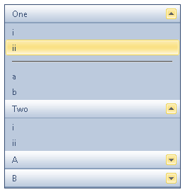

# Separators


## 

The panel bar layout can be customized through separators. Use separators for visually grouping items into two or more categories. You can also use them to achieve cosmetic effects.

To set a given panel item as a separator, set its **IsSeparator** property to **True**. The **Text** property of separators still be rendered, but the item will not respond when the user clicks it, and the other visual attributes of the item that come from the skin are not present for separators. (That is, separators display as text on a blank background.)

The example below shows panel bar with two separator items: one on the root items, and one on the child items of the first root item. The separator on the root items has its text set to an empty string, while the separator on the child items has its text set to `<hr>` to produce a horizontal rule:



````ASPNET

<telerik:RadPanelBar RenderMode="Lightweight" ID="RadPanelBar1" runat="server" Skin="Office2010Blue">
 <Items>
   <telerik:RadPanelItem runat="server" Text="One">
     <Items>
       <telerik:RadPanelItem runat="server" Text="i" />
       <telerik:RadPanelItem runat="server" Text="ii" />
       <telerik:RadPanelItem runat="server"
         IsSeparator="True"
         Text="<hr>" />
       <telerik:RadPanelItem runat="server" Text="a" />
       <telerik:RadPanelItem runat="server" Text="b" />
     </Items>
   </telerik:RadPanelItem>
   <telerik:RadPanelItem runat="server" Text="Two">
     <Items>
       <telerik:RadPanelItem runat="server" Text="i" />
       <telerik:RadPanelItem runat="server" Text="ii" />
     </Items>
   </telerik:RadPanelItem>
   <telerik:RadPanelItem runat="server"
      IsSeparator="True">
   </telerik:RadPanelItem>
   <telerik:RadPanelItem runat="server" Text="A">
      <Items>
         <telerik:RadPanelItem runat="server" Text="a" />
         <telerik:RadPanelItem runat="server" Text="b" />
      </Items>
   </telerik:RadPanelItem>
   <telerik:RadPanelItem runat="server" Text="B">
      <Items>
        <telerik:RadPanelItem runat="server" Text="a" />
        <telerik:RadPanelItem runat="server" Text="b" />
      </Items>
   </telerik:RadPanelItem>
 </Items>
</telerik:RadPanelBar>
				
````


