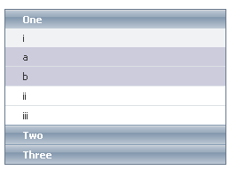

# Setting  the CSS Class of Items


**RadPanelItem** objects have a number of properties whose value is the name of a CSS class. These properties let you alter the appearance of individual tabs in the tab strip without using a [custom skin]().

>caution Typically, the [Skin]() overrides some of the attributes set using the CSS class properties. If your CSS class does not achieve the desired effect, try using the **!important** modifier, or look at the [skin CSS file]() to understand what is happening.
>


* **CssClass**: controls the appearance of the item in all states.

* **SelectedCssClass**: controls the appearance of the item when it is selected.

* **DisabledCssClass**: controls the appearance of the item when it is disabled.

* **FocusedCssClass**: controls the appearance of the item when it has focus.

* **ExpandedCssClass**: controls the appearance of the item when it is expanded.

* **ClickedCssClass**: controls the appearance of the item when it is clicked.

* **ChildGroupCssClass**: controls the appearance of the set of child items that appear when the item is expanded.

Most of these properties have a default value that identifies a class that is defined in the skin CSS file. For example, the default value for a disabled item is "rpDisabled".

To set the CSS class properties of an item at design time, use the [RadPanelBar Item Builder]().

>note The CSS class of a tab is applied to the anchor `<a>` tag that represents the item in the rendered HTML output, except for the **ChildGroupCssClass** property, which is applied to an unordered list `<ul>`. For more information about the rendered output of **RadPanelBar**, see [Understanding the Skin CSS File]().
>


## Defining the CSS Class

There are two ways you can define the CSS classes that you add using the CSS class properties:

* You can use a separate CSS file. When taking this approach, you must add a `<link>` tag to the `<head>` section of the ASPX file:

````ASPNET
<head runat="server">
    <title>Untitled Page</title>
    <link href="App_Data/MyStyles.css" rel="stylesheet" type="text/css" />
</head>
````


* You can define the styles directly in the `<head>` section of the ASPX file:

````ASPNET
<head runat="server">
    <title>Untitled Page</title>
    <style>
        .MyItem
        {
            background: red;
        }
    </style>
</head>
````


## Example

The following example uses the **ChildGroupCssClass** property to make the appearance of level 2 items more visually distinct:



````ASPNET
<head runat="server">
    <title>Untitled Page</title>
    <style>
        .Shaded
        {
            background: #ccd;
        }
    </style>
</head>
<body>
    <form id="form1" runat="server">
    <asp:ScriptManager ID="ScriptManager1" runat="server" />
    <telerik:radpanelbar id="RadPanelBar1" runat="server" skin="WebBlue">      
    <Items>        
        <telerik:RadPanelItem runat="server" Text="One" >         
         <Items>            
             <telerik:RadPanelItem runat="server" Text="i" ChildGroupCssClass="Shaded" >              
             <Items>                
                 <telerik:RadPanelItem runat="server" Text="a" />                
                 <telerik:RadPanelItem runat="server" Text="b" />              
             </Items>            
             </telerik:RadPanelItem>            
             <telerik:RadPanelItem runat="server" Text="ii" />           
             <telerik:RadPanelItem runat="server" Text="iii" />          
         </Items>       
         </telerik:RadPanelItem>        
         <telerik:RadPanelItem runat="server" Text="Two" />       
         <telerik:RadPanelItem runat="server" Text="Three" />      
     </Items>    
     </telerik:radpanelbar>
    </form>
</body>
````


